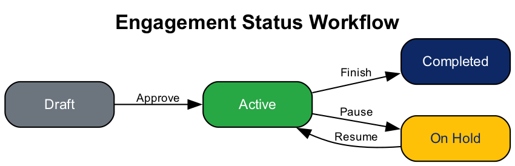
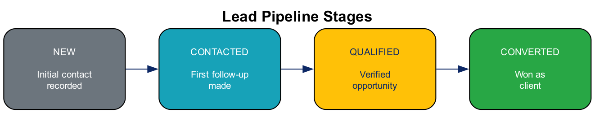
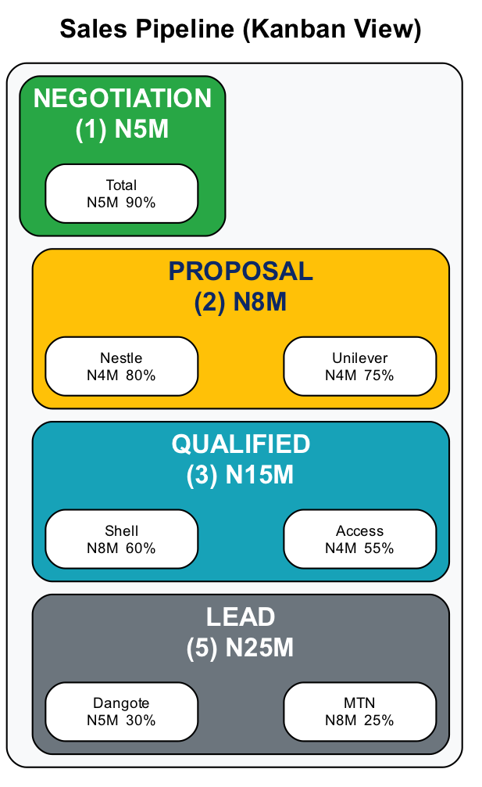
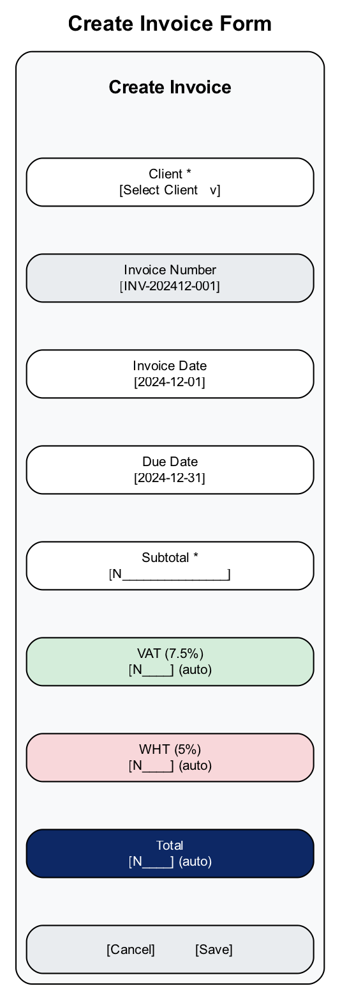
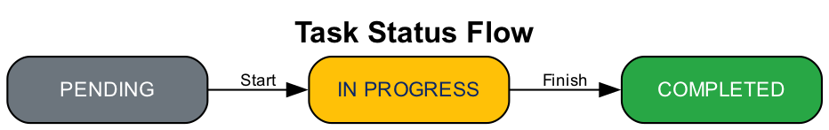
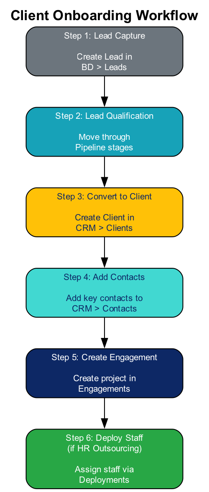

# ConsultPro User Manual

## HR & Consulting Management Platform

**Version:** 1.0
**Date:** December 2025
**Platform:** TeamACE Nigeria

---

# Table of Contents

1. [Introduction](#1-introduction)
2. [Getting Started](#2-getting-started)
3. [Dashboard Overview](#3-dashboard-overview)
4. [CRM Module](#4-crm-module)
5. [Business Development Module](#5-business-development-module)
6. [HR Outsourcing Module](#6-hr-outsourcing-module)
7. [Finance Module](#7-finance-module)
8. [Task Management](#8-task-management)
9. [Workflows & Best Practices](#9-workflows--best-practices)
10. [Troubleshooting](#10-troubleshooting)

---

# 1. Introduction

## 1.1 About ConsultPro

ConsultPro is a comprehensive HR and Consulting Management Platform designed specifically for Nigerian consulting firms. It provides end-to-end management of client relationships, business development, staff outsourcing, and financial operations.

## 1.2 Key Features

## 1.3 Nigeria-Specific Compliance

ConsultPro includes built-in compliance for Nigerian financial regulations:

- **VAT (Value Added Tax):** 7.5% automatically calculated on invoices
- **WHT (Withholding Tax):** 5% for services, 10% for professional services
- **TIN Validation:** Nigerian Tax Identification Number format support
- **RC Number:** CAC Registration number tracking
- **Currency:** Nigerian Naira (NGN) formatting throughout

---

# 2. Getting Started

## 2.1 System Requirements

- Modern web browser (Chrome, Firefox, Safari, or Edge)
- Internet connection
- Screen resolution: 1280x720 or higher recommended

## 2.2 Accessing the Platform

1. Open your web browser
2. Navigate to the ConsultPro URL provided by your administrator
3. You will see the login screen

## 2.3 Login Process

**Steps to Login:**
1. Enter your registered email address
2. Enter your password
3. Click "Sign In"
4. Upon successful login, you'll be redirected to the Dashboard

**Demo Credentials (for testing):**
- Email: `admin@teamace.ng`
- Password: `Demo123!`

## 2.4 Navigation Overview

The main navigation is located in the left sidebar:

---

# 3. Dashboard Overview

## 3.1 Dashboard Layout

The Dashboard provides a quick overview of your business operations at a glance.

## 3.2 Dashboard Metrics Explained

| Metric | Description |
|--------|-------------|
| Active Clients | Number of clients with active engagements |
| Active Leads | Open leads not yet converted |
| Deployed Staff | Staff currently assigned to client sites |
| Outstanding Revenue | Total unpaid invoice amounts |

---

# 4. CRM Module

The CRM (Customer Relationship Management) module helps you manage your client relationships, contacts, and engagements.

## 4.1 Clients

### Viewing Clients

The Clients page displays all your client companies in a searchable, filterable list. Each row shows:
- Company icon/avatar
- Company name
- Industry
- Status (Active, Prospect, Inactive)
- Action buttons (Edit, Delete)

### Adding a New Client

1. Click the **"+ Add Client"** button
2. Fill in the client details form:

**Required Fields:** Company Name (*)

### Client Detail View

Click on any client row to view detailed information:

- Contact information
- Compliance details (TIN, RC Number)
- Status and tier information
- Associated contacts and engagements

## 4.2 Contacts

### Managing Contacts

Contacts are individual people associated with your client companies. The contacts list shows:
- Contact avatar (initials)
- Full name
- Associated company
- Email address
- Decision maker status

### Adding a Contact

1. Click **"+ Add Contact"**
2. Select the associated client company
3. Enter contact details:
   - First Name, Last Name (required)
   - Email, Phone
   - Job Title, Department
   - Mark as "Decision Maker" if applicable

## 4.3 Engagements

Engagements represent active projects or service contracts with clients.

### Engagement Types

| Type | Description |
|------|-------------|
| HR Outsourcing | Staff placement and management services |
| Recruitment | Talent acquisition services |
| Training | Corporate training programs |
| Consulting | Advisory and consulting services |
| Payroll | Payroll management services |

### Engagement Status Workflow

### Creating an Engagement

1. Click **"+ Add Engagement"**
2. Select the client
3. Enter engagement details:
   - Engagement Name
   - Type (HR Outsourcing, Recruitment, etc.)
   - Contract Value (in NGN)
   - Start and End dates
   - Description

---

# 5. Business Development Module

## 5.1 Lead Management

### Lead Pipeline Stages

### Lead Sources

Track where your leads come from:

| Source | Description |
|--------|-------------|
| Website | Leads from your company website |
| Referral | Client or partner referrals |
| Cold Call | Outbound prospecting |
| Event | Conferences, seminars, networking |
| Social Media | LinkedIn, etc. |
| Other | Any other source |

### Adding a Lead

## 5.2 Sales Pipeline

### Kanban View

The Pipeline page provides a visual Kanban board of your sales pipeline:

### Understanding Pipeline Metrics

- **Stage Count:** Number of leads in each stage
- **Stage Value:** Total estimated value of leads in stage
- **Probability:** Likelihood of closing (increases as lead progresses)

---

# 6. HR Outsourcing Module

## 6.1 Staff Pool

### Staff Status Types

| Status | Description | Color |
|--------|-------------|-------|
| Available | Ready for deployment | Green |
| Deployed | Currently assigned to client | Blue |
| On Leave | Temporarily unavailable | Yellow |

### Staff Profile

### Adding Staff

1. Click **"+ Add Staff"**
2. Fill in employee details:
   - Employee ID (auto-generated or custom)
   - First Name, Last Name
   - Contact information
   - Job Title and Department
   - Skills (comma-separated)
   - Hourly Rate

## 6.2 Deployments

### Deployment Workflow

### Creating a Deployment

1. Navigate to **HR > Deployments**
2. Click **"+ Add Deployment"**
3. Select:
   - Staff Member (from pool)
   - Client Company
   - Role/Position at client
   - Start Date
   - Billing Rate and Type

### Billing Types

| Type | Description |
|------|-------------|
| Hourly | Billed per hour worked |
| Daily | Billed per day |
| Monthly | Fixed monthly billing |

---

# 7. Finance Module

## 7.1 Invoices

### Invoice Workflow

### Nigerian Tax Calculation

ConsultPro automatically calculates Nigerian taxes:

**Tax Rules:**
- VAT Rate: 7.5% on subtotal
- WHT Rate: 5% for services (10% for professional services)
- Total = Subtotal + VAT - WHT

### Creating an Invoice

1. Navigate to **Finance > Invoices**
2. Click **"+ Add Invoice"**
3. Fill in the form:

### Invoice Summary Dashboard

The invoices page displays summary metrics at the top:
- **Outstanding:** Total unpaid invoice amounts
- **Paid (Month):** Total payments received this month
- **Overdue:** Total overdue invoice amounts

## 7.2 Payments

### Recording Payments

1. Navigate to **Finance > Payments**
2. Click **"+ Add Payment"**
3. Select the invoice (only unpaid invoices shown)
4. Enter payment details:
   - Payment Date
   - Amount
   - Payment Method
   - Reference Number

### Payment Methods

| Method | Description |
|--------|-------------|
| Bank Transfer | Electronic bank transfer |
| Cash | Cash payment |
| Cheque | Payment by cheque |
| Card | Credit/Debit card |
| Other | Other payment methods |

---

# 8. Task Management

## 8.1 Task Overview

Tasks help you track action items and to-dos across all modules.

### Task Priority Levels

| Priority | Color | Usage |
|----------|-------|-------|
| Urgent | Red | Critical items needing immediate attention |
| High | Orange | Important items to complete soon |
| Medium | Blue | Standard priority items |
| Low | Gray | Can be deferred if needed |

### Task Status Flow

## 8.2 Task List View

## 8.3 Creating Tasks

1. Click **"+ Add Task"**
2. Enter task details:
   - Title (required)
   - Description
   - Associated Client (optional)
   - Priority Level
   - Due Date
   - Initial Status

---

# 9. Workflows & Best Practices

## 9.1 Complete Client Onboarding Workflow

## 9.2 Monthly Billing Workflow

## 9.3 Best Practices

### Data Entry
- Always fill in required fields (marked with *)
- Use consistent naming conventions
- Keep contact information up to date
- Add notes for important context

### Lead Management
- Update lead status promptly
- Add estimated values for pipeline forecasting
- Set realistic expected close dates
- Document all interactions in notes

### Financial Management
- Create invoices promptly after service delivery
- Set appropriate due dates (default: 30 days)
- Record payments immediately upon receipt
- Monitor overdue invoices regularly

### Task Management
- Create tasks for all action items
- Set appropriate priorities
- Update status as work progresses
- Link tasks to relevant clients

---

# 10. Troubleshooting

## 10.1 Common Issues

### Login Problems

| Issue | Solution |
|-------|----------|
| Invalid credentials | Verify email and password |
| Session expired | Log in again |
| Page not loading | Clear browser cache and refresh |

### Data Not Saving

| Issue | Solution |
|-------|----------|
| Form validation error | Check required fields are filled |
| Network error | Check internet connection |
| Save button not responding | Refresh page and try again |

### Display Issues

| Issue | Solution |
|-------|----------|
| Layout broken | Refresh page or clear cache |
| Data not loading | Wait for loading to complete |
| Sidebar missing | Toggle mobile menu on small screens |

## 10.2 Getting Help

For technical support:
1. Contact your system administrator
2. Report issues with specific error messages
3. Include steps to reproduce the problem

---

# Quick Reference Card

## Module Quick Access

| Module | Path |
|--------|------|
| Dashboard | / |
| Clients | /clients |
| Contacts | /contacts |
| Engagements | /engagements |
| Leads | /leads |
| Pipeline | /pipeline |
| Staff | /staff |
| Deployments | /deployments |
| Invoices | /invoices |
| Payments | /payments |
| Tasks | /tasks |

## Status Colors

| Color | Meaning |
|-------|---------|
| Green | Active, Available, Completed, Paid |
| Blue | In Progress, Deployed |
| Yellow | Pending, On Hold, Partial |
| Orange | High Priority |
| Red | Overdue, Urgent |
| Gray | Inactive, Low Priority |

---

*ConsultPro User Manual v1.0*
*Powered by Rozitech CC*
*December 2025*
