# Software Requirements Specification (SRS)

## TeamACE CRM-ERP Platform - Phase 1: Foundation Modules

**Document Version:** 1.0
**Date:** November 30, 2025
**Status:** Draft for Partner Review
**Prepared by:** Rozitech Development Team

---

## Table of Contents

1. [Introduction](#1-introduction)
2. [Overall Description](#2-overall-description)
3. [Module 1.1: Core CRM & Client Management](#3-module-11-core-crm--client-management)
4. [Module 1.2: Business Development Essentials](#4-module-12-business-development-essentials)
5. [Module 1.3: HR Outsourcing Essentials](#5-module-13-hr-outsourcing-essentials)
6. [Module 1.4: Finance Light](#6-module-14-finance-light-invoicing--receivables)
7. [Module 1.5: Collaboration & Workflow Layer](#7-module-15-collaboration--workflow-layer)
8. [Data Requirements](#8-data-requirements)
9. [Non-Functional Requirements](#9-non-functional-requirements)
10. [External Interface Requirements](#10-external-interface-requirements)
11. [Security Requirements](#11-security-requirements)
12. [Appendices](#12-appendices)

---

## 1. Introduction

### 1.1 Purpose

This Software Requirements Specification (SRS) document defines the complete functional and non-functional requirements for Phase 1 (Foundation Modules) of the TeamACE CRM-ERP Platform. Phase 1 establishes the root-level entities and core functionality upon which all subsequent phases depend.

This document serves as the authoritative reference for:
- Development team implementation guidance
- Quality assurance test case derivation
- Partner acceptance criteria validation
- Project scope and boundary definition

### 1.2 Scope

Phase 1 encompasses five interconnected foundation modules:

| Module | Description | Effort | Reuse Level |
|--------|-------------|--------|-------------|
| 1.1 Core CRM & Client Management | Central client database, contacts, engagements | 3-4 sprints | 60% (InvoiceFlow) |
| 1.2 Business Development | Lead management, sales pipeline, proposals | 3-4 sprints | 50% (Workforce) |
| 1.3 HR Outsourcing Essentials | Staff deployment, client assignments | 2-3 sprints | 80% (Workforce) |
| 1.4 Finance Light | Invoicing, payments, receivables | 2-3 sprints | 70% (InvoiceFlow) |
| 1.5 Collaboration & Workflow | Notes, approvals, notifications, tasks | 2-3 sprints | 40% (Workforce) |

**Total Phase 1 Duration:** 12 sprints (~24 weeks / 6 months)

### 1.3 Definitions, Acronyms, and Abbreviations

| Term | Definition |
|------|------------|
| CRM | Customer Relationship Management |
| ERP | Enterprise Resource Planning |
| JWT | JSON Web Token |
| CRUD | Create, Read, Update, Delete |
| RBAC | Role-Based Access Control |
| SaaS | Software as a Service |
| API | Application Programming Interface |
| UUID | Universally Unique Identifier |
| JSONB | JSON Binary (PostgreSQL data type) |
| PAYE | Pay As You Earn (Nigeria tax) |
| VAT | Value Added Tax |
| WHT | Withholding Tax |
| TIN | Tax Identification Number |
| BD | Business Development |
| HR | Human Resources |
| ESS | Employee Self-Service |
| SLA | Service Level Agreement |
| KPI | Key Performance Indicator |
| OCR | Optical Character Recognition |

### 1.4 References

- TeamACE CRM-ERP Development Plan v1.0 (November 29, 2025)
- Rozitech Workforce Application Technical Documentation
- Rozitech InvoiceFlow Application Technical Documentation
- Rozitech Auth Server API Specification
- Nigeria Federal Inland Revenue Service (FIRS) Guidelines
- Nigeria Companies and Allied Matters Act (CAMA) 2020

### 1.5 Document Overview

This SRS is organized into twelve sections:

- **Sections 1-2:** Introduction and overall system description
- **Sections 3-7:** Detailed functional requirements for each Phase 1 module
- **Sections 8-11:** Data, non-functional, interface, and security requirements
- **Section 12:** Appendices with supplementary technical details

---

## 2. Overall Description

### 2.1 Product Perspective

TeamACE CRM-ERP is a comprehensive business management platform designed specifically for HR consulting and outsourcing firms operating in Nigeria. The system integrates customer relationship management, business development, human resource outsourcing, and financial management into a unified platform.

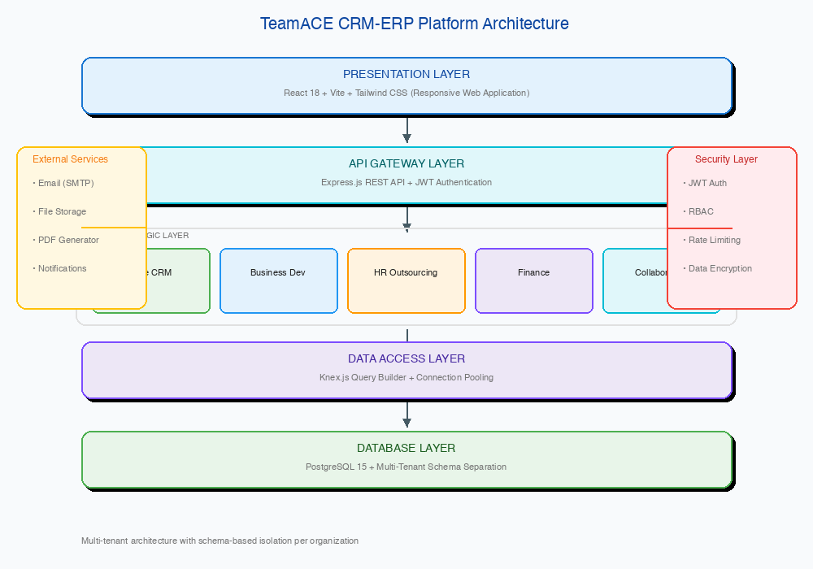

**Architecture Layers:**

- **Presentation Layer**: React 18 single-page application with Tailwind CSS for responsive design
- **API Gateway Layer**: Express.js RESTful API with JWT-based authentication
- **Business Logic Layer**: Five specialized modules handling CRM, sales, HR, finance, and workflow
- **Data Access Layer**: Knex.js query builder with connection pooling
- **Database Layer**: PostgreSQL with multi-tenant schema isolation

### 2.2 Product Functions Summary

| Module | Primary Functions |
|--------|-------------------|
| Core CRM | Client profiles, contact management, engagement tracking, document management, activity logging |
| Business Development | Lead capture, sales pipeline, proposal management, revenue forecasting, bulk communications |
| HR Outsourcing | Staff-client assignments, deployment tracking, contract management, service logging |
| Finance Light | Invoice generation, payment tracking, receivables management, financial reporting |
| Collaboration | Notes, comments, approval workflows, notifications, task management |

### 2.3 User Classes and Characteristics

| User Class | Description | Primary Access |
|------------|-------------|----------------|
| System Administrator | Platform operator with full access | All modules, system configuration |
| Managing Director | C-level executive oversight | Dashboard, reports, approvals |
| Business Development Manager | Sales and BD team lead | CRM, BD, proposals |
| Account Manager | Client relationship owner | CRM, engagements, service logs |
| HR Manager | HR operations team lead | HR outsourcing, staff management |
| Payroll Administrator | Payroll processing staff | Finance, payroll integration |
| Finance Manager | Financial operations | Invoicing, payments, reports |
| Staff Member | General employee | ESS, assigned tasks |
| External Auditor | Read-only compliance review | Reports, audit trails |

### 2.4 Operating Environment

| Component | Specification |
|-----------|---------------|
| **Backend Runtime** | Node.js 18+ LTS |
| **Web Framework** | Express.js 4.x |
| **Database** | PostgreSQL 14+ with UUID and JSONB support |
| **Frontend Framework** | React 18.x with Vite build tool |
| **CSS Framework** | Tailwind CSS 3.x |
| **Authentication** | JWT with multi-tenant support |
| **Deployment** | Docker containers on Render.com |
| **Supported Browsers** | Chrome, Firefox, Safari, Edge (latest 2 versions) |
| **Mobile Support** | Responsive design (PWA-ready) |

### 2.5 Design and Implementation Constraints

1. **Multi-tenancy:** Schema-based separation per tenant organization
2. **Reuse Priority:** Maximize adaptation of existing Rozitech modules (Workforce, InvoiceFlow)
3. **Whitelabel Ready:** Configurable branding (logo, colors, company name)
4. **Nigeria Focus:** Tax calculations, currency (NGN), banking formats per Nigerian standards
5. **Audit Compliance:** Full audit trail for all data modifications
6. **API-First:** All functionality exposed via RESTful API
7. **Offline Awareness:** Graceful degradation for intermittent connectivity

### 2.6 Assumptions and Dependencies

**Assumptions:**
- TeamACE operates primarily within Nigeria
- Users have modern web browsers and stable internet access
- Client companies have standard organizational structures
- Financial data requires reconciliation with external accounting systems

**Dependencies:**
- Rozitech Auth Server for authentication and authorization
- Email service provider (SendGrid/Mailgun) for notifications
- Cloud storage service for document management
- SMS gateway for Nigeria mobile notifications (future)

---

## 3. Module 1.1: Core CRM & Client Management

### 3.1 Module Overview

The Core CRM & Client Management module establishes the central client database that serves as the foundation for all client-related operations across the platform. This module manages company profiles, key contacts, client engagements/projects, document storage, and interaction logging.

**Priority:** CRITICAL - Build First
**Estimated Effort:** 3-4 sprints (6-8 weeks)
**Reuse Source:** InvoiceFlow client model (60%)

### 3.2 Data Entities

#### 3.2.1 Clients Entity

| Field | Type | Constraints | Description |
|-------|------|-------------|-------------|
| id | UUID | PK, auto-generated | Unique client identifier |
| organization_id | UUID | FK, NOT NULL | Tenant organization |
| company_name | VARCHAR(255) | NOT NULL | Legal company name |
| trading_name | VARCHAR(255) | | Trading/DBA name |
| industry | VARCHAR(100) | | Industry sector |
| company_size | ENUM | | micro/small/medium/large/enterprise |
| registration_number | VARCHAR(50) | | CAC registration number |
| tax_id | VARCHAR(50) | | Tax Identification Number |
| vat_number | VARCHAR(50) | | VAT registration number |
| website | VARCHAR(255) | | Company website URL |
| logo_url | VARCHAR(500) | | Company logo storage path |
| address_line1 | VARCHAR(255) | | Primary address |
| address_line2 | VARCHAR(255) | | Secondary address |
| city | VARCHAR(100) | | City |
| state | VARCHAR(100) | | State/Region |
| country | VARCHAR(100) | DEFAULT 'Nigeria' | Country |
| postal_code | VARCHAR(20) | | Postal/ZIP code |
| phone | VARCHAR(50) | | Primary phone |
| email | VARCHAR(255) | | Primary email |
| client_type | ENUM | NOT NULL | prospect/active/inactive/former |
| client_tier | ENUM | | standard/premium/enterprise |
| account_manager_id | UUID | FK | Assigned account manager |
| credit_limit | DECIMAL(15,2) | | Credit limit in NGN |
| payment_terms | INTEGER | DEFAULT 30 | Payment terms (days) |
| contract_start_date | DATE | | Contract start date |
| contract_end_date | DATE | | Contract end date |
| notes | TEXT | | Internal notes |
| custom_fields | JSONB | | Tenant-specific custom fields |
| created_by | UUID | FK | Creator user ID |
| created_at | TIMESTAMP | DEFAULT NOW() | Creation timestamp |
| updated_at | TIMESTAMP | | Last update timestamp |
| deleted_at | TIMESTAMP | | Soft delete timestamp |

#### 3.2.2 Contacts Entity

| Field | Type | Constraints | Description |
|-------|------|-------------|-------------|
| id | UUID | PK, auto-generated | Unique contact identifier |
| organization_id | UUID | FK, NOT NULL | Tenant organization |
| client_id | UUID | FK, NOT NULL | Parent client |
| first_name | VARCHAR(100) | NOT NULL | First name |
| last_name | VARCHAR(100) | NOT NULL | Last name |
| job_title | VARCHAR(100) | | Job title/position |
| department | VARCHAR(100) | | Department |
| email | VARCHAR(255) | | Email address |
| phone | VARCHAR(50) | | Direct phone |
| mobile | VARCHAR(50) | | Mobile phone |
| linkedin_url | VARCHAR(500) | | LinkedIn profile |
| is_primary | BOOLEAN | DEFAULT FALSE | Primary contact flag |
| is_decision_maker | BOOLEAN | DEFAULT FALSE | Decision maker flag |
| is_billing_contact | BOOLEAN | DEFAULT FALSE | Billing contact flag |
| contact_preferences | JSONB | | Preferred contact methods |
| birthday | DATE | | Birthday (for relationship building) |
| notes | TEXT | | Personal notes |
| created_at | TIMESTAMP | DEFAULT NOW() | Creation timestamp |
| updated_at | TIMESTAMP | | Last update timestamp |
| deleted_at | TIMESTAMP | | Soft delete timestamp |

#### 3.2.3 Engagements Entity

| Field | Type | Constraints | Description |
|-------|------|-------------|-------------|
| id | UUID | PK, auto-generated | Unique engagement identifier |
| organization_id | UUID | FK, NOT NULL | Tenant organization |
| client_id | UUID | FK, NOT NULL | Associated client |
| engagement_number | VARCHAR(50) | UNIQUE | Auto-generated reference |
| name | VARCHAR(255) | NOT NULL | Engagement/project name |
| description | TEXT | | Detailed description |
| engagement_type | ENUM | NOT NULL | outsourcing/consulting/recruitment/training/other |
| status | ENUM | NOT NULL | draft/active/on_hold/completed/cancelled |
| priority | ENUM | DEFAULT 'medium' | low/medium/high/critical |
| start_date | DATE | | Planned start date |
| end_date | DATE | | Planned end date |
| actual_start_date | DATE | | Actual start date |
| actual_end_date | DATE | | Actual end date |
| contract_value | DECIMAL(15,2) | | Total contract value |
| billing_type | ENUM | | fixed/hourly/monthly/milestone |
| billing_rate | DECIMAL(15,2) | | Rate per billing type |
| currency | VARCHAR(3) | DEFAULT 'NGN' | Currency code |
| primary_contact_id | UUID | FK | Primary client contact |
| account_manager_id | UUID | FK | TeamACE account manager |
| contract_document_url | VARCHAR(500) | | Contract document path |
| custom_fields | JSONB | | Custom engagement fields |
| created_by | UUID | FK | Creator user ID |
| created_at | TIMESTAMP | DEFAULT NOW() | Creation timestamp |
| updated_at | TIMESTAMP | | Last update timestamp |
| deleted_at | TIMESTAMP | | Soft delete timestamp |

#### 3.2.4 Documents Entity

| Field | Type | Constraints | Description |
|-------|------|-------------|-------------|
| id | UUID | PK, auto-generated | Unique document identifier |
| organization_id | UUID | FK, NOT NULL | Tenant organization |
| entity_type | VARCHAR(50) | NOT NULL | client/contact/engagement/etc |
| entity_id | UUID | NOT NULL | Associated entity ID |
| document_type | ENUM | NOT NULL | contract/proposal/report/invoice/other |
| file_name | VARCHAR(255) | NOT NULL | Original filename |
| file_path | VARCHAR(500) | NOT NULL | Storage path |
| file_size | INTEGER | | File size in bytes |
| mime_type | VARCHAR(100) | | MIME type |
| version | INTEGER | DEFAULT 1 | Document version |
| is_current | BOOLEAN | DEFAULT TRUE | Current version flag |
| parent_document_id | UUID | FK | Previous version reference |
| description | TEXT | | Document description |
| tags | VARCHAR[] | | Searchable tags |
| uploaded_by | UUID | FK | Uploader user ID |
| created_at | TIMESTAMP | DEFAULT NOW() | Upload timestamp |
| deleted_at | TIMESTAMP | | Soft delete timestamp |

#### 3.2.5 Activity Logs Entity

| Field | Type | Constraints | Description |
|-------|------|-------------|-------------|
| id | UUID | PK, auto-generated | Unique activity identifier |
| organization_id | UUID | FK, NOT NULL | Tenant organization |
| entity_type | VARCHAR(50) | NOT NULL | client/contact/engagement/etc |
| entity_id | UUID | NOT NULL | Associated entity ID |
| activity_type | ENUM | NOT NULL | call/email/meeting/note/status_change/etc |
| subject | VARCHAR(255) | | Activity subject/title |
| description | TEXT | | Activity details |
| outcome | VARCHAR(255) | | Activity outcome |
| activity_date | TIMESTAMP | NOT NULL | When activity occurred |
| duration_minutes | INTEGER | | Duration in minutes |
| participants | JSONB | | List of participants |
| attachments | JSONB | | Related document IDs |
| follow_up_date | TIMESTAMP | | Follow-up reminder date |
| follow_up_notes | TEXT | | Follow-up notes |
| created_by | UUID | FK, NOT NULL | User who logged activity |
| created_at | TIMESTAMP | DEFAULT NOW() | Creation timestamp |

### 3.3 Functional Requirements

#### 3.3.1 Client Management

| ID | Requirement | Priority |
|----|-------------|----------|
| CRM-C001 | System shall create new client company profiles with all required fields | Critical |
| CRM-C002 | System shall validate Nigerian TIN format (10-12 digits) | High |
| CRM-C003 | System shall validate CAC registration number format | High |
| CRM-C004 | System shall prevent duplicate clients based on company name + registration number | Critical |
| CRM-C005 | System shall support client status transitions: prospect → active → inactive/former | Critical |
| CRM-C006 | System shall automatically assign engagement numbers in format: ENG-YYYY-NNNN | High |
| CRM-C007 | System shall support bulk client import via CSV template | Medium |
| CRM-C008 | System shall export client list to CSV/Excel | Medium |
| CRM-C009 | System shall display client org chart showing contacts and relationships | Low |
| CRM-C010 | System shall track all client record modifications in audit log | Critical |
| CRM-C011 | System shall allow soft deletion of clients (not permanent delete) | Critical |
| CRM-C012 | System shall filter clients by type, tier, industry, account manager | High |
| CRM-C013 | System shall search clients by name, registration number, TIN | Critical |
| CRM-C014 | System shall display client dashboard with key metrics | High |
| CRM-C015 | System shall show all related entities (contacts, engagements, invoices) on client profile | Critical |

#### 3.3.2 Contact Management

| ID | Requirement | Priority |
|----|-------------|----------|
| CRM-CT001 | System shall create contacts linked to a parent client | Critical |
| CRM-CT002 | System shall validate email format for contacts | High |
| CRM-CT003 | System shall validate Nigerian phone number format (+234...) | Medium |
| CRM-CT004 | System shall designate one contact as primary per client | High |
| CRM-CT005 | System shall flag contacts as decision makers | High |
| CRM-CT006 | System shall flag contacts as billing contacts | High |
| CRM-CT007 | System shall support multiple contacts per client (no limit) | Critical |
| CRM-CT008 | System shall display contact birthday reminders | Low |
| CRM-CT009 | System shall search contacts across all clients | High |
| CRM-CT010 | System shall export contact list to CSV/Excel | Medium |

#### 3.3.3 Engagement Management

| ID | Requirement | Priority |
|----|-------------|----------|
| CRM-E001 | System shall create engagements linked to a client | Critical |
| CRM-E002 | System shall auto-generate unique engagement numbers | Critical |
| CRM-E003 | System shall support engagement types: outsourcing, consulting, recruitment, training, other | Critical |
| CRM-E004 | System shall track engagement status lifecycle | Critical |
| CRM-E005 | System shall calculate engagement duration (planned vs actual) | High |
| CRM-E006 | System shall support multiple billing types per engagement | High |
| CRM-E007 | System shall link engagement to primary client contact | High |
| CRM-E008 | System shall assign account manager to each engagement | Critical |
| CRM-E009 | System shall attach contract documents to engagements | High |
| CRM-E010 | System shall trigger alerts for expiring engagements (30, 14, 7 days) | High |
| CRM-E011 | System shall display engagement timeline with activities | High |
| CRM-E012 | System shall show financial summary per engagement | High |
| CRM-E013 | System shall support engagement cloning for renewals | Medium |
| CRM-E014 | System shall filter engagements by status, type, client, date range | High |

#### 3.3.4 Document Management

| ID | Requirement | Priority |
|----|-------------|----------|
| CRM-D001 | System shall upload documents up to 25MB per file | Critical |
| CRM-D002 | System shall support file types: PDF, DOC/DOCX, XLS/XLSX, PNG, JPG | Critical |
| CRM-D003 | System shall maintain document version history | High |
| CRM-D004 | System shall mark latest document version as current | High |
| CRM-D005 | System shall categorize documents by type | High |
| CRM-D006 | System shall tag documents for searchability | Medium |
| CRM-D007 | System shall search documents by name, type, tags | High |
| CRM-D008 | System shall preview PDF documents in browser | Medium |
| CRM-D009 | System shall download documents with original filename | Critical |
| CRM-D010 | System shall track document download/view history | Medium |
| CRM-D011 | System shall enforce document access based on user role | Critical |

#### 3.3.5 Activity Logging

| ID | Requirement | Priority |
|----|-------------|----------|
| CRM-A001 | System shall log activities against any entity (client, contact, engagement) | Critical |
| CRM-A002 | System shall support activity types: call, email, meeting, note, status_change | Critical |
| CRM-A003 | System shall record activity date/time and duration | High |
| CRM-A004 | System shall track activity participants | High |
| CRM-A005 | System shall attach documents to activities | Medium |
| CRM-A006 | System shall set follow-up reminders on activities | High |
| CRM-A007 | System shall display activity timeline per entity | Critical |
| CRM-A008 | System shall filter activities by type, date range, user | High |
| CRM-A009 | System shall auto-log status changes as activities | High |
| CRM-A010 | System shall display recent activities on dashboard | High |

### 3.4 User Interface Requirements

#### 3.4.1 Client Screens

| Screen | Description |
|--------|-------------|
| Client List | Paginated table with filters, search, quick actions |
| Client Create/Edit | Multi-section form with validation |
| Client Detail | Tabbed view: Overview, Contacts, Engagements, Documents, Activities, Invoices |
| Client Dashboard | Widget-based summary with KPIs |

#### 3.4.2 Contact Screens

| Screen | Description |
|--------|-------------|
| Contact List | Global contact directory with client grouping |
| Contact Create/Edit | Modal form linked to client |
| Contact Detail | Profile card with activity history |

#### 3.4.3 Engagement Screens

| Screen | Description |
|--------|-------------|
| Engagement List | Table with status filters and date range |
| Engagement Create/Edit | Wizard-style multi-step form |
| Engagement Detail | Tabbed view: Overview, Staff, Financials, Documents, Activities |
| Engagement Kanban | Board view by status for visual management |

### 3.5 API Specifications

#### 3.5.1 Client Endpoints

| Method | Endpoint | Description |
|--------|----------|-------------|
| GET | /api/clients | List clients with pagination and filters |
| GET | /api/clients/:id | Get client by ID with relations |
| POST | /api/clients | Create new client |
| PUT | /api/clients/:id | Update client |
| DELETE | /api/clients/:id | Soft delete client |
| GET | /api/clients/:id/contacts | Get client contacts |
| GET | /api/clients/:id/engagements | Get client engagements |
| GET | /api/clients/:id/documents | Get client documents |
| GET | /api/clients/:id/activities | Get client activities |
| GET | /api/clients/:id/invoices | Get client invoices |
| POST | /api/clients/import | Bulk import clients from CSV |
| GET | /api/clients/export | Export clients to CSV/Excel |

#### 3.5.2 Contact Endpoints

| Method | Endpoint | Description |
|--------|----------|-------------|
| GET | /api/contacts | List all contacts with filters |
| GET | /api/contacts/:id | Get contact by ID |
| POST | /api/contacts | Create contact |
| PUT | /api/contacts/:id | Update contact |
| DELETE | /api/contacts/:id | Soft delete contact |
| PUT | /api/contacts/:id/set-primary | Set as primary contact |

#### 3.5.3 Engagement Endpoints

| Method | Endpoint | Description |
|--------|----------|-------------|
| GET | /api/engagements | List engagements with filters |
| GET | /api/engagements/:id | Get engagement by ID |
| POST | /api/engagements | Create engagement |
| PUT | /api/engagements/:id | Update engagement |
| DELETE | /api/engagements/:id | Soft delete engagement |
| PUT | /api/engagements/:id/status | Update engagement status |
| POST | /api/engagements/:id/clone | Clone engagement |
| GET | /api/engagements/:id/staff | Get assigned staff |
| GET | /api/engagements/:id/invoices | Get engagement invoices |

#### 3.5.4 Document Endpoints

| Method | Endpoint | Description |
|--------|----------|-------------|
| GET | /api/documents | List documents with filters |
| GET | /api/documents/:id | Get document metadata |
| GET | /api/documents/:id/download | Download document file |
| POST | /api/documents | Upload document |
| PUT | /api/documents/:id | Update document metadata |
| DELETE | /api/documents/:id | Soft delete document |
| POST | /api/documents/:id/version | Upload new version |

#### 3.5.5 Activity Endpoints

| Method | Endpoint | Description |
|--------|----------|-------------|
| GET | /api/activities | List activities with filters |
| GET | /api/activities/:id | Get activity by ID |
| POST | /api/activities | Log new activity |
| PUT | /api/activities/:id | Update activity |
| DELETE | /api/activities/:id | Delete activity |
| GET | /api/activities/recent | Get recent activities for dashboard |

### 3.6 Business Rules

| ID | Rule | Enforcement |
|----|------|-------------|
| BR-C001 | Client registration number must be unique within organization | Database constraint + API validation |
| BR-C002 | Client cannot be deleted if active engagements exist | API validation |
| BR-C003 | Primary contact must exist before engagement can be created | API validation |
| BR-C004 | Engagement contract value must be positive or zero | Database check constraint |
| BR-C005 | Engagement end date must be after start date | API validation |
| BR-C006 | Only one document version can be marked as current | Application logic |
| BR-C007 | Activity date cannot be in the future (except follow-ups) | API validation |
| BR-C008 | Account manager must be a valid system user | Foreign key constraint |

---

## 4. Module 1.2: Business Development Essentials

### 4.1 Module Overview

The Business Development Essentials module manages the sales pipeline from initial lead capture through to closed deals. It enables tracking of potential clients, sales opportunities, proposals, and revenue forecasting.

**Priority:** HIGH
**Estimated Effort:** 3-4 sprints (6-8 weeks)
**Reuse Source:** Workforce recruitment pipeline (50%)

### 4.2 Data Entities

#### 4.2.1 Leads Entity

| Field | Type | Constraints | Description |
|-------|------|-------------|-------------|
| id | UUID | PK, auto-generated | Unique lead identifier |
| organization_id | UUID | FK, NOT NULL | Tenant organization |
| lead_number | VARCHAR(50) | UNIQUE | Auto-generated reference (LD-YYYY-NNNN) |
| company_name | VARCHAR(255) | NOT NULL | Prospect company name |
| contact_name | VARCHAR(255) | | Primary contact name |
| contact_email | VARCHAR(255) | | Contact email |
| contact_phone | VARCHAR(50) | | Contact phone |
| contact_title | VARCHAR(100) | | Contact job title |
| industry | VARCHAR(100) | | Industry sector |
| company_size | ENUM | | micro/small/medium/large/enterprise |
| source | ENUM | NOT NULL | referral/website/linkedin/cold_call/event/other |
| source_details | VARCHAR(255) | | Source-specific details |
| status | ENUM | NOT NULL | new/contacted/qualified/unqualified/converted |
| score | INTEGER | | Lead score (0-100) |
| estimated_value | DECIMAL(15,2) | | Estimated deal value |
| service_interest | VARCHAR[] | | Services of interest |
| notes | TEXT | | Lead notes |
| assigned_to | UUID | FK | Assigned BD representative |
| converted_to_client_id | UUID | FK | Converted client reference |
| converted_at | TIMESTAMP | | Conversion timestamp |
| next_follow_up | TIMESTAMP | | Next follow-up date |
| last_contacted | TIMESTAMP | | Last contact date |
| created_by | UUID | FK | Creator user ID |
| created_at | TIMESTAMP | DEFAULT NOW() | Creation timestamp |
| updated_at | TIMESTAMP | | Last update timestamp |

#### 4.2.2 Pipeline Stages Entity

| Field | Type | Constraints | Description |
|-------|------|-------------|-------------|
| id | UUID | PK, auto-generated | Unique stage identifier |
| organization_id | UUID | FK, NOT NULL | Tenant organization |
| name | VARCHAR(100) | NOT NULL | Stage name |
| description | TEXT | | Stage description |
| order_index | INTEGER | NOT NULL | Display order |
| probability | INTEGER | | Win probability (0-100%) |
| color | VARCHAR(7) | | Hex color code for UI |
| is_default | BOOLEAN | DEFAULT FALSE | Default stage for new opportunities |
| is_won | BOOLEAN | DEFAULT FALSE | Marks closed-won stage |
| is_lost | BOOLEAN | DEFAULT FALSE | Marks closed-lost stage |
| created_at | TIMESTAMP | DEFAULT NOW() | Creation timestamp |

**Default Pipeline Stages:**
1. Qualification (10%)
2. Needs Analysis (25%)
3. Proposal Sent (50%)
4. Negotiation (75%)
5. Closed Won (100%)
6. Closed Lost (0%)

#### 4.2.3 Opportunities Entity

| Field | Type | Constraints | Description |
|-------|------|-------------|-------------|
| id | UUID | PK, auto-generated | Unique opportunity identifier |
| organization_id | UUID | FK, NOT NULL | Tenant organization |
| opportunity_number | VARCHAR(50) | UNIQUE | Auto-generated (OPP-YYYY-NNNN) |
| name | VARCHAR(255) | NOT NULL | Opportunity name |
| description | TEXT | | Detailed description |
| client_id | UUID | FK | Existing client (if any) |
| lead_id | UUID | FK | Source lead (if any) |
| stage_id | UUID | FK, NOT NULL | Current pipeline stage |
| deal_value | DECIMAL(15,2) | NOT NULL | Expected deal value |
| currency | VARCHAR(3) | DEFAULT 'NGN' | Currency code |
| probability | INTEGER | | Win probability override |
| weighted_value | DECIMAL(15,2) | | Calculated: value × probability |
| expected_close_date | DATE | | Expected closing date |
| actual_close_date | DATE | | Actual closing date |
| service_type | VARCHAR(100) | | Type of service |
| contract_duration_months | INTEGER | | Expected contract length |
| competitors | VARCHAR[] | | Known competitors |
| decision_makers | JSONB | | Key decision makers |
| next_step | TEXT | | Next action required |
| loss_reason | VARCHAR(255) | | Reason if lost |
| won_reason | VARCHAR(255) | | Key winning factor |
| assigned_to | UUID | FK | Assigned BD representative |
| created_by | UUID | FK | Creator user ID |
| created_at | TIMESTAMP | DEFAULT NOW() | Creation timestamp |
| updated_at | TIMESTAMP | | Last update timestamp |

#### 4.2.4 Proposals Entity

| Field | Type | Constraints | Description |
|-------|------|-------------|-------------|
| id | UUID | PK, auto-generated | Unique proposal identifier |
| organization_id | UUID | FK, NOT NULL | Tenant organization |
| proposal_number | VARCHAR(50) | UNIQUE | Auto-generated (PRP-YYYY-NNNN) |
| opportunity_id | UUID | FK | Related opportunity |
| client_id | UUID | FK | Target client |
| title | VARCHAR(255) | NOT NULL | Proposal title |
| executive_summary | TEXT | | Executive summary |
| scope_of_work | TEXT | | Detailed scope |
| deliverables | JSONB | | List of deliverables |
| pricing | JSONB | | Pricing breakdown |
| total_value | DECIMAL(15,2) | | Total proposal value |
| currency | VARCHAR(3) | DEFAULT 'NGN' | Currency code |
| validity_days | INTEGER | DEFAULT 30 | Validity period |
| valid_until | DATE | | Expiration date |
| status | ENUM | NOT NULL | draft/sent/viewed/accepted/rejected/expired |
| sent_at | TIMESTAMP | | Date/time sent |
| sent_to | VARCHAR[] | | Recipient emails |
| viewed_at | TIMESTAMP | | First view timestamp |
| response_date | TIMESTAMP | | Client response date |
| response_notes | TEXT | | Client feedback |
| template_id | UUID | FK | Source template |
| document_url | VARCHAR(500) | | Generated PDF path |
| created_by | UUID | FK | Creator user ID |
| created_at | TIMESTAMP | DEFAULT NOW() | Creation timestamp |
| updated_at | TIMESTAMP | | Last update timestamp |

#### 4.2.5 Communication Logs Entity

| Field | Type | Constraints | Description |
|-------|------|-------------|-------------|
| id | UUID | PK, auto-generated | Unique log identifier |
| organization_id | UUID | FK, NOT NULL | Tenant organization |
| entity_type | VARCHAR(50) | NOT NULL | lead/opportunity/client |
| entity_id | UUID | NOT NULL | Related entity ID |
| communication_type | ENUM | NOT NULL | email/call/meeting/sms/whatsapp |
| direction | ENUM | NOT NULL | inbound/outbound |
| subject | VARCHAR(255) | | Subject/topic |
| content | TEXT | | Communication content |
| participants | JSONB | | Participants list |
| scheduled_at | TIMESTAMP | | Scheduled time (for meetings) |
| duration_minutes | INTEGER | | Duration in minutes |
| outcome | TEXT | | Communication outcome |
| follow_up_required | BOOLEAN | DEFAULT FALSE | Follow-up needed |
| follow_up_date | TIMESTAMP | | Follow-up date |
| attachments | JSONB | | Attachment references |
| logged_by | UUID | FK | Logger user ID |
| created_at | TIMESTAMP | DEFAULT NOW() | Creation timestamp |

### 4.3 Functional Requirements

#### 4.3.1 Lead Management

| ID | Requirement | Priority |
|----|-------------|----------|
| BD-L001 | System shall capture leads with company and contact information | Critical |
| BD-L002 | System shall auto-generate unique lead numbers | Critical |
| BD-L003 | System shall track lead source (referral, website, LinkedIn, cold call, event) | Critical |
| BD-L004 | System shall assign leads to BD representatives | Critical |
| BD-L005 | System shall score leads based on configurable criteria | High |
| BD-L006 | System shall track lead status progression | Critical |
| BD-L007 | System shall convert qualified leads to clients | Critical |
| BD-L008 | System shall prevent duplicate leads (same company name + email) | High |
| BD-L009 | System shall capture web form leads via API | High |
| BD-L010 | System shall import leads from CSV | Medium |
| BD-L011 | System shall display lead aging (days since creation) | High |
| BD-L012 | System shall send follow-up reminders | High |
| BD-L013 | System shall show lead conversion rate analytics | High |
| BD-L014 | System shall filter leads by source, status, assigned user, date | High |
| BD-L015 | System shall export leads to CSV | Medium |

#### 4.3.2 Pipeline Management

| ID | Requirement | Priority |
|----|-------------|----------|
| BD-P001 | System shall display visual Kanban board of pipeline stages | Critical |
| BD-P002 | System shall allow drag-drop movement between stages | Critical |
| BD-P003 | System shall auto-calculate weighted pipeline value | Critical |
| BD-P004 | System shall support custom pipeline stages per organization | High |
| BD-P005 | System shall track stage duration (time in stage) | High |
| BD-P006 | System shall log all stage transitions | Critical |
| BD-P007 | System shall display pipeline by BD representative | High |
| BD-P008 | System shall show pipeline velocity metrics | Medium |
| BD-P009 | System shall alert on stale opportunities (configurable days) | High |
| BD-P010 | System shall support multiple pipelines (optional) | Low |

#### 4.3.3 Opportunity Management

| ID | Requirement | Priority |
|----|-------------|----------|
| BD-O001 | System shall create opportunities linked to leads or clients | Critical |
| BD-O002 | System shall auto-generate unique opportunity numbers | Critical |
| BD-O003 | System shall calculate weighted value (deal value × probability) | Critical |
| BD-O004 | System shall track expected and actual close dates | Critical |
| BD-O005 | System shall record competitors on opportunities | Medium |
| BD-O006 | System shall track decision makers | High |
| BD-O007 | System shall capture win/loss reasons | Critical |
| BD-O008 | System shall link opportunities to proposals | High |
| BD-O009 | System shall show opportunity history timeline | High |
| BD-O010 | System shall duplicate opportunities | Low |
| BD-O011 | System shall filter opportunities by stage, value, date, owner | High |

#### 4.3.4 Proposal Management

| ID | Requirement | Priority |
|----|-------------|----------|
| BD-PR001 | System shall create proposals linked to opportunities | Critical |
| BD-PR002 | System shall auto-generate unique proposal numbers | Critical |
| BD-PR003 | System shall support proposal templates | High |
| BD-PR004 | System shall include scope of work and deliverables | Critical |
| BD-PR005 | System shall include detailed pricing breakdown | Critical |
| BD-PR006 | System shall calculate total proposal value | Critical |
| BD-PR007 | System shall set validity period and expiration date | High |
| BD-PR008 | System shall generate PDF proposal documents | Critical |
| BD-PR009 | System shall email proposals directly from system | High |
| BD-PR010 | System shall track proposal views (optional tracking link) | Medium |
| BD-PR011 | System shall track proposal status transitions | Critical |
| BD-PR012 | System shall support proposal versioning | Medium |
| BD-PR013 | System shall auto-expire proposals past validity date | High |
| BD-PR014 | System shall create engagement from accepted proposal | High |

#### 4.3.5 Revenue Forecasting

| ID | Requirement | Priority |
|----|-------------|----------|
| BD-F001 | System shall display forecast by pipeline stage | Critical |
| BD-F002 | System shall show weighted vs unweighted forecast | Critical |
| BD-F003 | System shall forecast by month/quarter | High |
| BD-F004 | System shall compare forecast vs actual (historical) | High |
| BD-F005 | System shall forecast by BD representative | High |
| BD-F006 | System shall forecast by service type | Medium |
| BD-F007 | System shall export forecast reports | High |

#### 4.3.6 Bulk Communications

| ID | Requirement | Priority |
|----|-------------|----------|
| BD-BC001 | System shall send bulk emails to selected leads/contacts | High |
| BD-BC002 | System shall support email templates with merge fields | High |
| BD-BC003 | System shall track email open rates (optional) | Low |
| BD-BC004 | System shall schedule bulk communications | Medium |
| BD-BC005 | System shall send birthday greetings (automated) | Low |
| BD-BC006 | System shall maintain unsubscribe list | High |
| BD-BC007 | System shall log all communications | Critical |

### 4.4 User Interface Requirements

#### 4.4.1 Lead Screens

| Screen | Description |
|--------|-------------|
| Lead List | Paginated table with status filters, search |
| Lead Create/Edit | Form with validation, duplicate check |
| Lead Detail | Profile with activities, conversion action |
| Lead Import | CSV upload wizard |

#### 4.4.2 Pipeline Screens

| Screen | Description |
|--------|-------------|
| Pipeline Kanban | Drag-drop board with opportunity cards |
| Pipeline Table | Alternative list view with all details |
| Pipeline Settings | Configure stages, probabilities, colors |

#### 4.4.3 Opportunity Screens

| Screen | Description |
|--------|-------------|
| Opportunity List | Filterable table view |
| Opportunity Create/Edit | Multi-section form |
| Opportunity Detail | Tabbed: Overview, Activities, Proposals, History |

#### 4.4.4 Proposal Screens

| Screen | Description |
|--------|-------------|
| Proposal List | Status-filtered table |
| Proposal Builder | Rich editor with sections |
| Proposal Preview | PDF preview before sending |
| Proposal Templates | Template management |

#### 4.4.5 Dashboard Screens

| Screen | Description |
|--------|-------------|
| BD Dashboard | Pipeline value, conversion rates, activities |
| Forecast Report | Monthly/quarterly projections |

### 4.5 API Specifications

#### 4.5.1 Lead Endpoints

| Method | Endpoint | Description |
|--------|----------|-------------|
| GET | /api/leads | List leads with filters |
| GET | /api/leads/:id | Get lead by ID |
| POST | /api/leads | Create lead |
| PUT | /api/leads/:id | Update lead |
| DELETE | /api/leads/:id | Delete lead |
| POST | /api/leads/:id/convert | Convert lead to client |
| POST | /api/leads/import | Import leads from CSV |
| GET | /api/leads/export | Export leads to CSV |
| POST | /api/leads/webhook | Web form capture endpoint |

#### 4.5.2 Pipeline Endpoints

| Method | Endpoint | Description |
|--------|----------|-------------|
| GET | /api/pipeline/stages | List pipeline stages |
| POST | /api/pipeline/stages | Create stage |
| PUT | /api/pipeline/stages/:id | Update stage |
| PUT | /api/pipeline/stages/reorder | Reorder stages |
| DELETE | /api/pipeline/stages/:id | Delete stage |
| GET | /api/pipeline/board | Get Kanban board data |

#### 4.5.3 Opportunity Endpoints

| Method | Endpoint | Description |
|--------|----------|-------------|
| GET | /api/opportunities | List opportunities |
| GET | /api/opportunities/:id | Get opportunity by ID |
| POST | /api/opportunities | Create opportunity |
| PUT | /api/opportunities/:id | Update opportunity |
| PUT | /api/opportunities/:id/stage | Move to stage |
| PUT | /api/opportunities/:id/close | Close won/lost |
| DELETE | /api/opportunities/:id | Delete opportunity |
| GET | /api/opportunities/:id/proposals | Get related proposals |

#### 4.5.4 Proposal Endpoints

| Method | Endpoint | Description |
|--------|----------|-------------|
| GET | /api/proposals | List proposals |
| GET | /api/proposals/:id | Get proposal by ID |
| POST | /api/proposals | Create proposal |
| PUT | /api/proposals/:id | Update proposal |
| DELETE | /api/proposals/:id | Delete proposal |
| POST | /api/proposals/:id/send | Send proposal |
| GET | /api/proposals/:id/pdf | Generate/download PDF |
| PUT | /api/proposals/:id/accept | Mark as accepted |
| PUT | /api/proposals/:id/reject | Mark as rejected |
| GET | /api/proposals/templates | List templates |
| POST | /api/proposals/templates | Create template |

#### 4.5.5 Forecast Endpoints

| Method | Endpoint | Description |
|--------|----------|-------------|
| GET | /api/forecast | Get forecast summary |
| GET | /api/forecast/by-stage | Forecast by pipeline stage |
| GET | /api/forecast/by-month | Forecast by month |
| GET | /api/forecast/by-user | Forecast by BD rep |

### 4.6 Business Rules

| ID | Rule | Enforcement |
|----|------|-------------|
| BR-BD001 | Lead cannot be converted if status is 'unqualified' | API validation |
| BR-BD002 | Opportunity must have deal value > 0 | Database check constraint |
| BR-BD003 | Closed opportunities cannot be edited (except notes) | API validation |
| BR-BD004 | Proposal cannot be sent if status is not 'draft' | API validation |
| BR-BD005 | Win probability must be 0-100 | Database check constraint |
| BR-BD006 | Lost opportunity must have loss_reason | API validation |
| BR-BD007 | Proposal validity cannot exceed 90 days | API validation |
| BR-BD008 | Cannot delete pipeline stage with opportunities | API validation |

---

## 5. Module 1.3: HR Outsourcing Essentials

### 5.1 Module Overview

The HR Outsourcing Essentials module extends the Workforce HRIS capabilities to manage staff deployed to client organizations. It tracks which employees are assigned to which clients, their deployment status, and services rendered.

**Priority:** HIGH
**Estimated Effort:** 2-3 sprints (4-6 weeks)
**Reuse Source:** Workforce HRIS (80%)

### 5.2 Data Entities

#### 5.2.1 Client Staff Assignments Entity

| Field | Type | Constraints | Description |
|-------|------|-------------|-------------|
| id | UUID | PK, auto-generated | Unique assignment identifier |
| organization_id | UUID | FK, NOT NULL | Tenant organization |
| employee_id | UUID | FK, NOT NULL | Assigned employee |
| client_id | UUID | FK, NOT NULL | Client organization |
| engagement_id | UUID | FK | Related engagement |
| assignment_number | VARCHAR(50) | UNIQUE | Auto-generated reference |
| position_title | VARCHAR(100) | NOT NULL | Position at client |
| department | VARCHAR(100) | | Client department |
| location | VARCHAR(255) | | Work location |
| supervisor_name | VARCHAR(255) | | Client-side supervisor |
| supervisor_email | VARCHAR(255) | | Supervisor email |
| supervisor_phone | VARCHAR(50) | | Supervisor phone |
| status | ENUM | NOT NULL | active/on_hold/completed/terminated |
| assignment_type | ENUM | NOT NULL | full_time/part_time/contract/temporary |
| start_date | DATE | NOT NULL | Assignment start date |
| expected_end_date | DATE | | Expected end date |
| actual_end_date | DATE | | Actual end date |
| billing_rate | DECIMAL(15,2) | | Billing rate to client |
| billing_frequency | ENUM | | hourly/daily/monthly |
| cost_rate | DECIMAL(15,2) | | Cost to TeamACE |
| margin_percentage | DECIMAL(5,2) | | Profit margin |
| probation_end_date | DATE | | Probation period end |
| confirmation_date | DATE | | Confirmation date |
| work_schedule | JSONB | | Work hours/days |
| special_terms | TEXT | | Special assignment terms |
| termination_reason | VARCHAR(255) | | Reason if terminated |
| termination_notes | TEXT | | Termination details |
| created_by | UUID | FK | Creator user ID |
| created_at | TIMESTAMP | DEFAULT NOW() | Creation timestamp |
| updated_at | TIMESTAMP | | Last update timestamp |

#### 5.2.2 Deployments Entity

| Field | Type | Constraints | Description |
|-------|------|-------------|-------------|
| id | UUID | PK, auto-generated | Unique deployment identifier |
| organization_id | UUID | FK, NOT NULL | Tenant organization |
| assignment_id | UUID | FK, NOT NULL | Parent assignment |
| deployment_type | ENUM | NOT NULL | initial/transfer/extension/return |
| location | VARCHAR(255) | NOT NULL | Deployment location |
| location_type | ENUM | | office/site/remote/hybrid |
| address | TEXT | | Full address |
| city | VARCHAR(100) | | City |
| state | VARCHAR(100) | | State |
| start_date | DATE | NOT NULL | Deployment start date |
| end_date | DATE | | Deployment end date |
| reason | TEXT | | Reason for deployment/transfer |
| approved_by | UUID | FK | Approver user ID |
| approved_at | TIMESTAMP | | Approval timestamp |
| notes | TEXT | | Additional notes |
| created_at | TIMESTAMP | DEFAULT NOW() | Creation timestamp |

#### 5.2.3 Contract Documents Entity

| Field | Type | Constraints | Description |
|-------|------|-------------|-------------|
| id | UUID | PK, auto-generated | Unique document identifier |
| organization_id | UUID | FK, NOT NULL | Tenant organization |
| assignment_id | UUID | FK, NOT NULL | Related assignment |
| document_type | ENUM | NOT NULL | employment_contract/nda/client_agreement/extension/termination |
| document_name | VARCHAR(255) | NOT NULL | Document name |
| file_path | VARCHAR(500) | NOT NULL | Storage path |
| version | INTEGER | DEFAULT 1 | Document version |
| effective_date | DATE | | Effective from date |
| expiry_date | DATE | | Expiration date |
| signed_by_employee | BOOLEAN | DEFAULT FALSE | Employee signed |
| signed_by_client | BOOLEAN | DEFAULT FALSE | Client signed |
| signed_by_teamace | BOOLEAN | DEFAULT FALSE | TeamACE signed |
| signature_date | DATE | | Signature date |
| is_active | BOOLEAN | DEFAULT TRUE | Active document flag |
| notes | TEXT | | Document notes |
| uploaded_by | UUID | FK | Uploader user ID |
| created_at | TIMESTAMP | DEFAULT NOW() | Upload timestamp |

#### 5.2.4 Service Logs Entity

| Field | Type | Constraints | Description |
|-------|------|-------------|-------------|
| id | UUID | PK, auto-generated | Unique log identifier |
| organization_id | UUID | FK, NOT NULL | Tenant organization |
| assignment_id | UUID | FK, NOT NULL | Related assignment |
| client_id | UUID | FK, NOT NULL | Client organization |
| service_date | DATE | NOT NULL | Date of service |
| service_type | ENUM | NOT NULL | regular_hours/overtime/on_call/training/meeting |
| hours_worked | DECIMAL(5,2) | | Hours worked |
| description | TEXT | | Service description |
| deliverables | TEXT | | Deliverables/output |
| billable | BOOLEAN | DEFAULT TRUE | Billable flag |
| billing_amount | DECIMAL(15,2) | | Calculated billing amount |
| approved_by_client | BOOLEAN | DEFAULT FALSE | Client approval |
| client_approval_date | TIMESTAMP | | Client approval date |
| client_approver_name | VARCHAR(255) | | Client approver name |
| notes | TEXT | | Additional notes |
| logged_by | UUID | FK | Logger user ID |
| created_at | TIMESTAMP | DEFAULT NOW() | Creation timestamp |
| updated_at | TIMESTAMP | | Last update timestamp |

### 5.3 Functional Requirements

#### 5.3.1 Staff Assignment Management

| ID | Requirement | Priority |
|----|-------------|----------|
| HR-A001 | System shall assign employees to client organizations | Critical |
| HR-A002 | System shall auto-generate unique assignment numbers | Critical |
| HR-A003 | System shall link assignments to client engagements | Critical |
| HR-A004 | System shall track assignment status lifecycle | Critical |
| HR-A005 | System shall record position and department at client | High |
| HR-A006 | System shall capture client-side supervisor details | High |
| HR-A007 | System shall support assignment types (full-time, part-time, contract, temporary) | High |
| HR-A008 | System shall track billing and cost rates per assignment | Critical |
| HR-A009 | System shall calculate margin percentage automatically | High |
| HR-A010 | System shall record probation and confirmation dates | High |
| HR-A011 | System shall capture work schedules | Medium |
| HR-A012 | System shall track termination with reasons | Critical |
| HR-A013 | System shall alert on expiring assignments (30, 14, 7 days) | High |
| HR-A014 | System shall prevent duplicate active assignments (same employee + client) | High |
| HR-A015 | System shall show assignment history per employee | High |

#### 5.3.2 Deployment Tracking

| ID | Requirement | Priority |
|----|-------------|----------|
| HR-D001 | System shall track deployment locations | Critical |
| HR-D002 | System shall support deployment types (initial, transfer, extension, return) | High |
| HR-D003 | System shall record deployment dates | Critical |
| HR-D004 | System shall capture approval workflow for transfers | High |
| HR-D005 | System shall maintain deployment history | High |
| HR-D006 | System shall report on staff by location | High |
| HR-D007 | System shall support multiple deployments per assignment | High |

#### 5.3.3 Contract Document Management

| ID | Requirement | Priority |
|----|-------------|----------|
| HR-CD001 | System shall upload contract documents per assignment | Critical |
| HR-CD002 | System shall categorize documents by type | High |
| HR-CD003 | System shall track document versions | High |
| HR-CD004 | System shall record effective and expiry dates | High |
| HR-CD005 | System shall track signature status (employee, client, TeamACE) | High |
| HR-CD006 | System shall alert on expiring contracts | Critical |
| HR-CD007 | System shall support document templates | Medium |

#### 5.3.4 Service Logging

| ID | Requirement | Priority |
|----|-------------|----------|
| HR-SL001 | System shall log services rendered per assignment | Critical |
| HR-SL002 | System shall track hours worked | High |
| HR-SL003 | System shall categorize service types | High |
| HR-SL004 | System shall calculate billing amounts | Critical |
| HR-SL005 | System shall flag billable vs non-billable services | High |
| HR-SL006 | System shall support client approval workflow | High |
| HR-SL007 | System shall generate service reports per client | Critical |
| HR-SL008 | System shall integrate with timesheet data (from Workforce) | Medium |
| HR-SL009 | System shall support bulk service log import | Medium |

#### 5.3.5 Employee Lifecycle at Client

| ID | Requirement | Priority |
|----|-------------|----------|
| HR-EL001 | System shall track hire date at client | Critical |
| HR-EL002 | System shall track probation status | High |
| HR-EL003 | System shall record confirmation | High |
| HR-EL004 | System shall support redeployment to different client | High |
| HR-EL005 | System shall track exit from client | Critical |
| HR-EL006 | System shall maintain employee timeline across clients | High |
| HR-EL007 | System shall support performance notes per assignment | Medium |

#### 5.3.6 Client-Based Payroll Grouping

| ID | Requirement | Priority |
|----|-------------|----------|
| HR-PG001 | System shall group employees by client for payroll | Critical |
| HR-PG002 | System shall support separate payroll runs per client | High |
| HR-PG003 | System shall link payroll to billing for reconciliation | High |
| HR-PG004 | System shall track salary funding by client | Medium |
| HR-PG005 | System shall report payroll cost vs billing per client | High |

### 5.4 User Interface Requirements

#### 5.4.1 Assignment Screens

| Screen | Description |
|--------|-------------|
| Assignment List | Filterable by client, status, employee |
| Assignment Create/Edit | Form with employee and client selection |
| Assignment Detail | Tabbed: Overview, Deployments, Documents, Service Logs |
| Assignment Timeline | Visual lifecycle view |

#### 5.4.2 Deployment Screens

| Screen | Description |
|--------|-------------|
| Deployment History | Timeline view per assignment |
| Deployment Create | Form with location and dates |
| Deployment Map | Geographic view of staff locations |

#### 5.4.3 Service Log Screens

| Screen | Description |
|--------|-------------|
| Service Log List | Filterable table |
| Service Log Entry | Quick entry form |
| Service Log Approval | Client approval workflow |
| Service Report | Summary by client/period |

### 5.5 API Specifications

#### 5.5.1 Assignment Endpoints

| Method | Endpoint | Description |
|--------|----------|-------------|
| GET | /api/assignments | List assignments with filters |
| GET | /api/assignments/:id | Get assignment by ID |
| POST | /api/assignments | Create assignment |
| PUT | /api/assignments/:id | Update assignment |
| PUT | /api/assignments/:id/status | Update assignment status |
| DELETE | /api/assignments/:id | Soft delete assignment |
| GET | /api/assignments/:id/deployments | Get deployment history |
| GET | /api/assignments/:id/documents | Get contract documents |
| GET | /api/assignments/:id/service-logs | Get service logs |
| GET | /api/employees/:id/assignments | Get assignments by employee |
| GET | /api/clients/:id/assignments | Get assignments by client |

#### 5.5.2 Deployment Endpoints

| Method | Endpoint | Description |
|--------|----------|-------------|
| GET | /api/deployments | List deployments |
| GET | /api/deployments/:id | Get deployment by ID |
| POST | /api/deployments | Create deployment |
| PUT | /api/deployments/:id | Update deployment |
| DELETE | /api/deployments/:id | Delete deployment |

#### 5.5.3 Contract Document Endpoints

| Method | Endpoint | Description |
|--------|----------|-------------|
| GET | /api/assignment-documents | List documents |
| GET | /api/assignment-documents/:id | Get document |
| POST | /api/assignment-documents | Upload document |
| PUT | /api/assignment-documents/:id | Update document |
| DELETE | /api/assignment-documents/:id | Delete document |
| GET | /api/assignment-documents/:id/download | Download document |

#### 5.5.4 Service Log Endpoints

| Method | Endpoint | Description |
|--------|----------|-------------|
| GET | /api/service-logs | List service logs |
| GET | /api/service-logs/:id | Get service log |
| POST | /api/service-logs | Create service log |
| PUT | /api/service-logs/:id | Update service log |
| DELETE | /api/service-logs/:id | Delete service log |
| PUT | /api/service-logs/:id/approve | Client approve |
| POST | /api/service-logs/bulk | Bulk create logs |
| GET | /api/service-logs/report | Generate report |

### 5.6 Business Rules

| ID | Rule | Enforcement |
|----|------|-------------|
| BR-HR001 | Employee cannot have multiple active assignments to same client | API validation |
| BR-HR002 | Assignment end date must be after start date | API validation |
| BR-HR003 | Billing rate must be greater than or equal to cost rate | API validation |
| BR-HR004 | Service log hours must be positive and ≤ 24 per day | API validation |
| BR-HR005 | Terminated assignment cannot be edited | API validation |
| BR-HR006 | Deployment must be linked to active assignment | API validation |
| BR-HR007 | Contract document expiry date must be after effective date | API validation |

---

## 6. Module 1.4: Finance Light (Invoicing + Receivables)

### 6.1 Module Overview

The Finance Light module provides essential invoicing and receivables management capabilities. It enables generation of client invoices, tracking of payments, and basic financial reporting without full accounting system complexity.

**Priority:** HIGH
**Estimated Effort:** 2-3 sprints (4-6 weeks)
**Reuse Source:** InvoiceFlow (70%)

### 6.2 Data Entities

#### 6.2.1 Invoices Entity

| Field | Type | Constraints | Description |
|-------|------|-------------|-------------|
| id | UUID | PK, auto-generated | Unique invoice identifier |
| organization_id | UUID | FK, NOT NULL | Tenant organization |
| invoice_number | VARCHAR(50) | UNIQUE | Auto-generated (INV-YYYY-NNNN) |
| client_id | UUID | FK, NOT NULL | Client organization |
| engagement_id | UUID | FK | Related engagement |
| billing_contact_id | UUID | FK | Billing contact |
| invoice_type | ENUM | NOT NULL | standard/proforma/credit_note |
| status | ENUM | NOT NULL | draft/sent/viewed/paid/partial/overdue/cancelled |
| issue_date | DATE | NOT NULL | Invoice date |
| due_date | DATE | NOT NULL | Payment due date |
| payment_terms | INTEGER | DEFAULT 30 | Payment terms (days) |
| currency | VARCHAR(3) | DEFAULT 'NGN' | Currency code |
| subtotal | DECIMAL(15,2) | NOT NULL | Sum of line items |
| discount_type | ENUM | | percentage/fixed |
| discount_value | DECIMAL(15,2) | | Discount amount |
| discount_amount | DECIMAL(15,2) | | Calculated discount |
| tax_rate | DECIMAL(5,2) | | VAT/tax rate |
| tax_amount | DECIMAL(15,2) | | Calculated tax |
| wht_rate | DECIMAL(5,2) | | Withholding tax rate |
| wht_amount | DECIMAL(15,2) | | WHT amount |
| total_amount | DECIMAL(15,2) | NOT NULL | Final total |
| amount_paid | DECIMAL(15,2) | DEFAULT 0 | Amount received |
| balance_due | DECIMAL(15,2) | | Remaining balance |
| notes | TEXT | | Invoice notes |
| terms_and_conditions | TEXT | | T&Cs text |
| billing_period_start | DATE | | Service period start |
| billing_period_end | DATE | | Service period end |
| sent_at | TIMESTAMP | | Date/time sent |
| sent_to | VARCHAR[] | | Recipient emails |
| viewed_at | TIMESTAMP | | First view timestamp |
| paid_at | TIMESTAMP | | Full payment date |
| cancelled_at | TIMESTAMP | | Cancellation date |
| cancellation_reason | TEXT | | Cancellation reason |
| pdf_url | VARCHAR(500) | | Generated PDF path |
| created_by | UUID | FK | Creator user ID |
| created_at | TIMESTAMP | DEFAULT NOW() | Creation timestamp |
| updated_at | TIMESTAMP | | Last update timestamp |

#### 6.2.2 Invoice Items Entity

| Field | Type | Constraints | Description |
|-------|------|-------------|-------------|
| id | UUID | PK, auto-generated | Unique item identifier |
| invoice_id | UUID | FK, NOT NULL | Parent invoice |
| line_number | INTEGER | NOT NULL | Line order |
| description | TEXT | NOT NULL | Item description |
| service_type | VARCHAR(100) | | Service category |
| quantity | DECIMAL(10,2) | DEFAULT 1 | Quantity |
| unit | VARCHAR(50) | | Unit (hours, days, units) |
| unit_price | DECIMAL(15,2) | NOT NULL | Price per unit |
| discount_percentage | DECIMAL(5,2) | | Line discount % |
| discount_amount | DECIMAL(15,2) | | Line discount amount |
| tax_rate | DECIMAL(5,2) | | Line tax rate |
| tax_amount | DECIMAL(15,2) | | Line tax amount |
| line_total | DECIMAL(15,2) | NOT NULL | Line total |
| assignment_id | UUID | FK | Related staff assignment |
| service_log_id | UUID | FK | Related service log |
| notes | TEXT | | Line notes |

#### 6.2.3 Payments Entity

| Field | Type | Constraints | Description |
|-------|------|-------------|-------------|
| id | UUID | PK, auto-generated | Unique payment identifier |
| organization_id | UUID | FK, NOT NULL | Tenant organization |
| payment_number | VARCHAR(50) | UNIQUE | Auto-generated (PMT-YYYY-NNNN) |
| invoice_id | UUID | FK, NOT NULL | Related invoice |
| client_id | UUID | FK, NOT NULL | Client organization |
| payment_date | DATE | NOT NULL | Date received |
| amount | DECIMAL(15,2) | NOT NULL | Payment amount |
| currency | VARCHAR(3) | DEFAULT 'NGN' | Currency code |
| payment_method | ENUM | NOT NULL | bank_transfer/cheque/cash/online |
| reference_number | VARCHAR(100) | | Bank/cheque reference |
| bank_name | VARCHAR(100) | | Bank name |
| status | ENUM | NOT NULL | pending/confirmed/failed/reversed |
| confirmed_by | UUID | FK | Confirmer user ID |
| confirmed_at | TIMESTAMP | | Confirmation date |
| notes | TEXT | | Payment notes |
| receipt_url | VARCHAR(500) | | Receipt document path |
| wht_certificate_url | VARCHAR(500) | | WHT certificate path |
| created_by | UUID | FK | Creator user ID |
| created_at | TIMESTAMP | DEFAULT NOW() | Creation timestamp |
| updated_at | TIMESTAMP | | Last update timestamp |

#### 6.2.4 Tax Rates Entity

| Field | Type | Constraints | Description |
|-------|------|-------------|-------------|
| id | UUID | PK, auto-generated | Unique rate identifier |
| organization_id | UUID | FK, NOT NULL | Tenant organization |
| name | VARCHAR(100) | NOT NULL | Tax name (e.g., "VAT", "WHT") |
| code | VARCHAR(20) | NOT NULL | Tax code |
| rate | DECIMAL(5,2) | NOT NULL | Tax rate percentage |
| description | TEXT | | Tax description |
| is_default | BOOLEAN | DEFAULT FALSE | Default tax flag |
| is_active | BOOLEAN | DEFAULT TRUE | Active flag |
| effective_from | DATE | | Effective start date |
| effective_to | DATE | | Effective end date |
| created_at | TIMESTAMP | DEFAULT NOW() | Creation timestamp |

**Default Nigeria Tax Rates:**
- VAT: 7.5%
- WHT (Services): 10%
- WHT (Contracts): 5%

#### 6.2.5 Billing Schedules Entity

| Field | Type | Constraints | Description |
|-------|------|-------------|-------------|
| id | UUID | PK, auto-generated | Unique schedule identifier |
| organization_id | UUID | FK, NOT NULL | Tenant organization |
| client_id | UUID | FK, NOT NULL | Client organization |
| engagement_id | UUID | FK | Related engagement |
| schedule_type | ENUM | NOT NULL | retainer/milestone/usage |
| frequency | ENUM | | weekly/monthly/quarterly/annual |
| amount | DECIMAL(15,2) | NOT NULL | Billing amount |
| description | TEXT | | Schedule description |
| start_date | DATE | NOT NULL | Schedule start date |
| end_date | DATE | | Schedule end date |
| next_invoice_date | DATE | | Next scheduled invoice |
| last_invoice_id | UUID | FK | Last generated invoice |
| is_active | BOOLEAN | DEFAULT TRUE | Active flag |
| auto_generate | BOOLEAN | DEFAULT FALSE | Auto-generate invoices |
| created_at | TIMESTAMP | DEFAULT NOW() | Creation timestamp |

### 6.3 Functional Requirements

#### 6.3.1 Invoice Management

| ID | Requirement | Priority |
|----|-------------|----------|
| FIN-I001 | System shall create invoices linked to clients | Critical |
| FIN-I002 | System shall auto-generate unique invoice numbers | Critical |
| FIN-I003 | System shall support invoice types: standard, proforma, credit note | High |
| FIN-I004 | System shall calculate subtotal from line items | Critical |
| FIN-I005 | System shall apply discounts (percentage or fixed) | High |
| FIN-I006 | System shall calculate VAT at configurable rate | Critical |
| FIN-I007 | System shall calculate WHT where applicable | High |
| FIN-I008 | System shall calculate final total amount | Critical |
| FIN-I009 | System shall track invoice status lifecycle | Critical |
| FIN-I010 | System shall link invoices to engagements | High |
| FIN-I011 | System shall link invoice items to service logs | High |
| FIN-I012 | System shall generate PDF invoices | Critical |
| FIN-I013 | System shall email invoices to billing contacts | High |
| FIN-I014 | System shall track invoice views | Medium |
| FIN-I015 | System shall support invoice cloning/copying | Medium |
| FIN-I016 | System shall support invoice cancellation with reason | High |
| FIN-I017 | System shall auto-calculate due date from payment terms | High |
| FIN-I018 | System shall mark invoices as overdue automatically | Critical |
| FIN-I019 | System shall support multiple currencies (NGN, USD, GBP, EUR) | Medium |
| FIN-I020 | System shall include billing period dates | High |

#### 6.3.2 Invoice Line Items

| ID | Requirement | Priority |
|----|-------------|----------|
| FIN-IL001 | System shall add multiple line items per invoice | Critical |
| FIN-IL002 | System shall support quantity and unit price | Critical |
| FIN-IL003 | System shall support line-level discounts | Medium |
| FIN-IL004 | System shall calculate line totals | Critical |
| FIN-IL005 | System shall link items to service logs | High |
| FIN-IL006 | System shall link items to staff assignments | Medium |
| FIN-IL007 | System shall reorder line items | Low |

#### 6.3.3 Payment Management

| ID | Requirement | Priority |
|----|-------------|----------|
| FIN-P001 | System shall record payments against invoices | Critical |
| FIN-P002 | System shall auto-generate unique payment numbers | Critical |
| FIN-P003 | System shall support partial payments | Critical |
| FIN-P004 | System shall update invoice balance due | Critical |
| FIN-P005 | System shall mark invoice as paid when balance is zero | Critical |
| FIN-P006 | System shall track payment methods (bank transfer, cheque, cash) | High |
| FIN-P007 | System shall capture bank reference numbers | High |
| FIN-P008 | System shall support payment confirmation workflow | High |
| FIN-P009 | System shall attach payment receipts | High |
| FIN-P010 | System shall attach WHT certificates | High |
| FIN-P011 | System shall reverse payments with reason | High |
| FIN-P012 | System shall reconcile payments across invoices | Medium |

#### 6.3.4 Receivables Management

| ID | Requirement | Priority |
|----|-------------|----------|
| FIN-R001 | System shall display receivables aging report | Critical |
| FIN-R002 | System shall categorize receivables by age (current, 30, 60, 90, 120+ days) | Critical |
| FIN-R003 | System shall show receivables by client | High |
| FIN-R004 | System shall alert on overdue invoices | Critical |
| FIN-R005 | System shall send payment reminders | High |
| FIN-R006 | System shall track collection activities | Medium |
| FIN-R007 | System shall calculate days sales outstanding (DSO) | High |
| FIN-R008 | System shall flag high-risk receivables | Medium |

#### 6.3.5 Billing Schedules

| ID | Requirement | Priority |
|----|-------------|----------|
| FIN-BS001 | System shall create recurring billing schedules | High |
| FIN-BS002 | System shall support frequencies: weekly, monthly, quarterly, annual | High |
| FIN-BS003 | System shall calculate next invoice date | High |
| FIN-BS004 | System shall auto-generate invoices from schedules | Medium |
| FIN-BS005 | System shall alert on upcoming scheduled invoices | High |
| FIN-BS006 | System shall link schedules to engagements | High |
| FIN-BS007 | System shall deactivate schedules on engagement end | High |

#### 6.3.6 Financial Reporting

| ID | Requirement | Priority |
|----|-------------|----------|
| FIN-FR001 | System shall display financial dashboard | Critical |
| FIN-FR002 | System shall show invoiced vs collected amounts | Critical |
| FIN-FR003 | System shall report revenue by client | High |
| FIN-FR004 | System shall report revenue by engagement type | High |
| FIN-FR005 | System shall show revenue trend charts | High |
| FIN-FR006 | System shall export financial reports to Excel | High |
| FIN-FR007 | System shall calculate collection rate | High |
| FIN-FR008 | System shall provide client profitability view | Medium |

### 6.4 User Interface Requirements

#### 6.4.1 Invoice Screens

| Screen | Description |
|--------|-------------|
| Invoice List | Status-filtered table with search |
| Invoice Create/Edit | Line item builder with calculations |
| Invoice Detail | View with payment history |
| Invoice Preview | PDF preview before sending |
| Invoice PDF | Printable/downloadable format |

#### 6.4.2 Payment Screens

| Screen | Description |
|--------|-------------|
| Payment List | Filterable by client, status, date |
| Payment Record | Form to record payment |
| Payment Detail | View with attached documents |
| Payment Confirmation | Approval workflow |

#### 6.4.3 Report Screens

| Screen | Description |
|--------|-------------|
| Receivables Aging | Aging buckets with drill-down |
| Revenue Dashboard | Charts and KPIs |
| Client Statement | Per-client transaction history |
| Financial Summary | Period-based summary |

### 6.5 API Specifications

#### 6.5.1 Invoice Endpoints

| Method | Endpoint | Description |
|--------|----------|-------------|
| GET | /api/invoices | List invoices with filters |
| GET | /api/invoices/:id | Get invoice by ID |
| POST | /api/invoices | Create invoice |
| PUT | /api/invoices/:id | Update invoice |
| DELETE | /api/invoices/:id | Delete draft invoice |
| POST | /api/invoices/:id/send | Send invoice |
| PUT | /api/invoices/:id/cancel | Cancel invoice |
| GET | /api/invoices/:id/pdf | Generate/download PDF |
| POST | /api/invoices/:id/clone | Clone invoice |
| GET | /api/invoices/:id/payments | Get invoice payments |
| GET | /api/clients/:id/invoices | Get client invoices |

#### 6.5.2 Payment Endpoints

| Method | Endpoint | Description |
|--------|----------|-------------|
| GET | /api/payments | List payments |
| GET | /api/payments/:id | Get payment by ID |
| POST | /api/payments | Record payment |
| PUT | /api/payments/:id | Update payment |
| PUT | /api/payments/:id/confirm | Confirm payment |
| PUT | /api/payments/:id/reverse | Reverse payment |
| DELETE | /api/payments/:id | Delete payment |

#### 6.5.3 Tax Rate Endpoints

| Method | Endpoint | Description |
|--------|----------|-------------|
| GET | /api/tax-rates | List tax rates |
| GET | /api/tax-rates/:id | Get tax rate |
| POST | /api/tax-rates | Create tax rate |
| PUT | /api/tax-rates/:id | Update tax rate |
| DELETE | /api/tax-rates/:id | Delete tax rate |

#### 6.5.4 Billing Schedule Endpoints

| Method | Endpoint | Description |
|--------|----------|-------------|
| GET | /api/billing-schedules | List schedules |
| GET | /api/billing-schedules/:id | Get schedule |
| POST | /api/billing-schedules | Create schedule |
| PUT | /api/billing-schedules/:id | Update schedule |
| DELETE | /api/billing-schedules/:id | Delete schedule |
| POST | /api/billing-schedules/:id/generate | Generate invoice |

#### 6.5.5 Report Endpoints

| Method | Endpoint | Description |
|--------|----------|-------------|
| GET | /api/reports/receivables-aging | Aging report |
| GET | /api/reports/revenue-summary | Revenue summary |
| GET | /api/reports/client-statement/:clientId | Client statement |
| GET | /api/reports/financial-dashboard | Dashboard data |

### 6.6 Business Rules

| ID | Rule | Enforcement |
|----|------|-------------|
| BR-FIN001 | Invoice number must be unique | Database constraint |
| BR-FIN002 | Sent invoices cannot be edited (only cancelled) | API validation |
| BR-FIN003 | Payment amount cannot exceed invoice balance | API validation |
| BR-FIN004 | VAT rate must be between 0 and 100 | Database check |
| BR-FIN005 | Due date must be on or after issue date | API validation |
| BR-FIN006 | Credit note must reference original invoice | API validation |
| BR-FIN007 | Confirmed payments cannot be deleted | API validation |
| BR-FIN008 | Cancelled invoices cannot receive payments | API validation |

---

## 7. Module 1.5: Collaboration & Workflow Layer

### 7.1 Module Overview

The Collaboration & Workflow Layer provides cross-cutting functionality that enables notes, comments, approval workflows, notifications, and task management across all other modules. This is a foundational module that all other modules depend on for collaboration features.

**Priority:** CRITICAL - Cross-cutting
**Estimated Effort:** 2-3 sprints (4-6 weeks)
**Reuse Source:** Workforce approval patterns (40%)

### 7.2 Data Entities

#### 7.2.1 Notes Entity (Polymorphic)

| Field | Type | Constraints | Description |
|-------|------|-------------|-------------|
| id | UUID | PK, auto-generated | Unique note identifier |
| organization_id | UUID | FK, NOT NULL | Tenant organization |
| entity_type | VARCHAR(50) | NOT NULL | client/engagement/lead/invoice/etc |
| entity_id | UUID | NOT NULL | Associated entity ID |
| content | TEXT | NOT NULL | Note content (markdown supported) |
| is_pinned | BOOLEAN | DEFAULT FALSE | Pinned note flag |
| visibility | ENUM | DEFAULT 'internal' | internal/team/public |
| mentions | UUID[] | | Mentioned user IDs |
| attachments | JSONB | | Attachment references |
| created_by | UUID | FK, NOT NULL | Creator user ID |
| created_at | TIMESTAMP | DEFAULT NOW() | Creation timestamp |
| updated_at | TIMESTAMP | | Last update timestamp |
| deleted_at | TIMESTAMP | | Soft delete timestamp |

#### 7.2.2 Comments Entity (Threaded)

| Field | Type | Constraints | Description |
|-------|------|-------------|-------------|
| id | UUID | PK, auto-generated | Unique comment identifier |
| organization_id | UUID | FK, NOT NULL | Tenant organization |
| entity_type | VARCHAR(50) | NOT NULL | Parent entity type |
| entity_id | UUID | NOT NULL | Parent entity ID |
| parent_comment_id | UUID | FK | Parent comment (for threads) |
| content | TEXT | NOT NULL | Comment content |
| mentions | UUID[] | | Mentioned user IDs |
| reactions | JSONB | | Emoji reactions |
| is_resolved | BOOLEAN | DEFAULT FALSE | Resolved flag |
| resolved_by | UUID | FK | Resolver user ID |
| resolved_at | TIMESTAMP | | Resolution timestamp |
| created_by | UUID | FK, NOT NULL | Creator user ID |
| created_at | TIMESTAMP | DEFAULT NOW() | Creation timestamp |
| updated_at | TIMESTAMP | | Last update timestamp |
| deleted_at | TIMESTAMP | | Soft delete timestamp |

#### 7.2.3 Approval Workflows Entity

| Field | Type | Constraints | Description |
|-------|------|-------------|-------------|
| id | UUID | PK, auto-generated | Unique workflow identifier |
| organization_id | UUID | FK, NOT NULL | Tenant organization |
| name | VARCHAR(100) | NOT NULL | Workflow name |
| description | TEXT | | Workflow description |
| entity_type | VARCHAR(50) | NOT NULL | Target entity type |
| trigger_conditions | JSONB | | When to trigger |
| is_active | BOOLEAN | DEFAULT TRUE | Active flag |
| created_at | TIMESTAMP | DEFAULT NOW() | Creation timestamp |
| updated_at | TIMESTAMP | | Last update timestamp |

#### 7.2.4 Approval Steps Entity

| Field | Type | Constraints | Description |
|-------|------|-------------|-------------|
| id | UUID | PK, auto-generated | Unique step identifier |
| workflow_id | UUID | FK, NOT NULL | Parent workflow |
| step_order | INTEGER | NOT NULL | Step sequence |
| name | VARCHAR(100) | NOT NULL | Step name |
| approver_type | ENUM | NOT NULL | user/role/department/manager |
| approver_id | UUID | | Specific user ID |
| approver_role | VARCHAR(50) | | Role name |
| is_optional | BOOLEAN | DEFAULT FALSE | Optional step |
| auto_approve_after_days | INTEGER | | Auto-approve timeout |
| escalation_after_days | INTEGER | | Escalation timeout |
| escalation_to | UUID | FK | Escalation user |
| created_at | TIMESTAMP | DEFAULT NOW() | Creation timestamp |

#### 7.2.5 Approval Requests Entity

| Field | Type | Constraints | Description |
|-------|------|-------------|-------------|
| id | UUID | PK, auto-generated | Unique request identifier |
| organization_id | UUID | FK, NOT NULL | Tenant organization |
| workflow_id | UUID | FK, NOT NULL | Source workflow |
| entity_type | VARCHAR(50) | NOT NULL | Target entity type |
| entity_id | UUID | NOT NULL | Target entity ID |
| current_step | INTEGER | | Current step number |
| status | ENUM | NOT NULL | pending/approved/rejected/cancelled |
| requested_by | UUID | FK, NOT NULL | Requester user ID |
| requested_at | TIMESTAMP | DEFAULT NOW() | Request timestamp |
| completed_at | TIMESTAMP | | Completion timestamp |
| notes | TEXT | | Request notes |

#### 7.2.6 Approval Decisions Entity

| Field | Type | Constraints | Description |
|-------|------|-------------|-------------|
| id | UUID | PK, auto-generated | Unique decision identifier |
| request_id | UUID | FK, NOT NULL | Parent request |
| step_id | UUID | FK, NOT NULL | Approval step |
| decision | ENUM | NOT NULL | approved/rejected/delegated |
| decided_by | UUID | FK, NOT NULL | Decider user ID |
| decided_at | TIMESTAMP | DEFAULT NOW() | Decision timestamp |
| delegated_to | UUID | FK | Delegation target |
| comments | TEXT | | Decision comments |
| attachments | JSONB | | Supporting documents |

#### 7.2.7 Notifications Entity

| Field | Type | Constraints | Description |
|-------|------|-------------|-------------|
| id | UUID | PK, auto-generated | Unique notification identifier |
| organization_id | UUID | FK, NOT NULL | Tenant organization |
| user_id | UUID | FK, NOT NULL | Recipient user |
| notification_type | ENUM | NOT NULL | approval/task/mention/alert/reminder |
| title | VARCHAR(255) | NOT NULL | Notification title |
| message | TEXT | NOT NULL | Notification content |
| entity_type | VARCHAR(50) | | Related entity type |
| entity_id | UUID | | Related entity ID |
| action_url | VARCHAR(500) | | Click action URL |
| is_read | BOOLEAN | DEFAULT FALSE | Read flag |
| read_at | TIMESTAMP | | Read timestamp |
| is_email_sent | BOOLEAN | DEFAULT FALSE | Email sent flag |
| email_sent_at | TIMESTAMP | | Email timestamp |
| priority | ENUM | DEFAULT 'normal' | low/normal/high/urgent |
| expires_at | TIMESTAMP | | Expiration date |
| created_at | TIMESTAMP | DEFAULT NOW() | Creation timestamp |

#### 7.2.8 Tasks Entity

| Field | Type | Constraints | Description |
|-------|------|-------------|-------------|
| id | UUID | PK, auto-generated | Unique task identifier |
| organization_id | UUID | FK, NOT NULL | Tenant organization |
| task_number | VARCHAR(50) | UNIQUE | Auto-generated (TSK-YYYY-NNNN) |
| title | VARCHAR(255) | NOT NULL | Task title |
| description | TEXT | | Task description |
| entity_type | VARCHAR(50) | | Related entity type |
| entity_id | UUID | | Related entity ID |
| status | ENUM | NOT NULL | open/in_progress/blocked/completed/cancelled |
| priority | ENUM | DEFAULT 'medium' | low/medium/high/critical |
| assigned_to | UUID | FK | Assignee user ID |
| assigned_by | UUID | FK | Assigner user ID |
| due_date | TIMESTAMP | | Due date/time |
| reminder_date | TIMESTAMP | | Reminder date |
| estimated_hours | DECIMAL(5,2) | | Estimated effort |
| actual_hours | DECIMAL(5,2) | | Actual effort |
| completed_at | TIMESTAMP | | Completion timestamp |
| completed_by | UUID | FK | Completer user ID |
| tags | VARCHAR[] | | Task tags |
| checklist | JSONB | | Subtasks checklist |
| attachments | JSONB | | Attachment references |
| recurrence | JSONB | | Recurrence pattern |
| created_by | UUID | FK, NOT NULL | Creator user ID |
| created_at | TIMESTAMP | DEFAULT NOW() | Creation timestamp |
| updated_at | TIMESTAMP | | Last update timestamp |

#### 7.2.9 Audit Logs Entity

| Field | Type | Constraints | Description |
|-------|------|-------------|-------------|
| id | UUID | PK, auto-generated | Unique log identifier |
| organization_id | UUID | FK, NOT NULL | Tenant organization |
| user_id | UUID | FK | Actor user ID |
| action | VARCHAR(50) | NOT NULL | create/update/delete/view/export |
| entity_type | VARCHAR(50) | NOT NULL | Target entity type |
| entity_id | UUID | NOT NULL | Target entity ID |
| entity_name | VARCHAR(255) | | Entity display name |
| old_values | JSONB | | Previous values |
| new_values | JSONB | | New values |
| ip_address | VARCHAR(45) | | Client IP |
| user_agent | TEXT | | Browser/client info |
| created_at | TIMESTAMP | DEFAULT NOW() | Timestamp |

### 7.3 Functional Requirements

#### 7.3.1 Notes Management

| ID | Requirement | Priority |
|----|-------------|----------|
| WF-N001 | System shall create notes on any entity (polymorphic) | Critical |
| WF-N002 | System shall support markdown formatting in notes | High |
| WF-N003 | System shall pin important notes to top | High |
| WF-N004 | System shall support note visibility levels | High |
| WF-N005 | System shall mention users in notes (@username) | High |
| WF-N006 | System shall notify mentioned users | High |
| WF-N007 | System shall attach files to notes | Medium |
| WF-N008 | System shall edit and delete own notes | High |
| WF-N009 | System shall display notes timeline per entity | Critical |
| WF-N010 | System shall search notes content | Medium |

#### 7.3.2 Comments Management

| ID | Requirement | Priority |
|----|-------------|----------|
| WF-C001 | System shall support threaded comments | High |
| WF-C002 | System shall reply to existing comments | High |
| WF-C003 | System shall mention users in comments | High |
| WF-C004 | System shall support emoji reactions | Low |
| WF-C005 | System shall mark comments as resolved | High |
| WF-C006 | System shall collapse resolved comment threads | Medium |
| WF-C007 | System shall notify on replies and mentions | High |

#### 7.3.3 Approval Workflows

| ID | Requirement | Priority |
|----|-------------|----------|
| WF-A001 | System shall define configurable approval workflows | Critical |
| WF-A002 | System shall support multi-step sequential approvals | Critical |
| WF-A003 | System shall assign approvers by user, role, or department | High |
| WF-A004 | System shall support parallel approvals (any/all) | Medium |
| WF-A005 | System shall notify approvers of pending requests | Critical |
| WF-A006 | System shall allow approval with comments | High |
| WF-A007 | System shall allow rejection with mandatory reason | High |
| WF-A008 | System shall support delegation to another user | High |
| WF-A009 | System shall auto-escalate after timeout | High |
| WF-A010 | System shall auto-approve after timeout (configurable) | Medium |
| WF-A011 | System shall track approval history | Critical |
| WF-A012 | System shall cancel pending approvals | High |
| WF-A013 | System shall show approval status on entity | Critical |

#### 7.3.4 Notifications

| ID | Requirement | Priority |
|----|-------------|----------|
| WF-NT001 | System shall display in-app notification bell | Critical |
| WF-NT002 | System shall show unread notification count | Critical |
| WF-NT003 | System shall mark notifications as read | Critical |
| WF-NT004 | System shall send email notifications | Critical |
| WF-NT005 | System shall support notification preferences per user | High |
| WF-NT006 | System shall prioritize notifications (low/normal/high/urgent) | High |
| WF-NT007 | System shall link notifications to source entities | Critical |
| WF-NT008 | System shall group related notifications | Medium |
| WF-NT009 | System shall expire old notifications | Medium |
| WF-NT010 | System shall support notification digest emails | Low |

#### 7.3.5 Task Management

| ID | Requirement | Priority |
|----|-------------|----------|
| WF-T001 | System shall create tasks with title and description | Critical |
| WF-T002 | System shall auto-generate unique task numbers | Critical |
| WF-T003 | System shall assign tasks to users | Critical |
| WF-T004 | System shall set task due dates | Critical |
| WF-T005 | System shall set task priorities | High |
| WF-T006 | System shall track task status | Critical |
| WF-T007 | System shall link tasks to entities | High |
| WF-T008 | System shall set task reminders | High |
| WF-T009 | System shall estimate and track time | Medium |
| WF-T010 | System shall support subtask checklists | Medium |
| WF-T011 | System shall attach files to tasks | Medium |
| WF-T012 | System shall comment on tasks | High |
| WF-T013 | System shall display my tasks dashboard | Critical |
| WF-T014 | System shall display team tasks view | High |
| WF-T015 | System shall send due date reminders | Critical |
| WF-T016 | System shall support recurring tasks | Medium |
| WF-T017 | System shall filter tasks by status, assignee, priority, due date | High |
| WF-T018 | System shall export tasks | Low |

#### 7.3.6 Audit Trail

| ID | Requirement | Priority |
|----|-------------|----------|
| WF-AU001 | System shall log all data modifications | Critical |
| WF-AU002 | System shall capture before/after values | Critical |
| WF-AU003 | System shall record acting user | Critical |
| WF-AU004 | System shall record timestamp | Critical |
| WF-AU005 | System shall record IP address | High |
| WF-AU006 | System shall record user agent | Medium |
| WF-AU007 | System shall display audit history per entity | Critical |
| WF-AU008 | System shall search audit logs | High |
| WF-AU009 | System shall export audit logs | High |
| WF-AU010 | System shall retain audit logs per policy | Critical |

### 7.4 User Interface Requirements

#### 7.4.1 Notes & Comments

| Screen | Description |
|--------|-------------|
| Notes Panel | Collapsible panel on entity detail pages |
| Note Editor | Rich text editor with markdown preview |
| Comments Thread | Nested comment display with reply |

#### 7.4.2 Approval Screens

| Screen | Description |
|--------|-------------|
| My Approvals | List of pending approval requests |
| Approval Detail | Request details with approve/reject actions |
| Approval History | Timeline of decisions |
| Workflow Config | Admin workflow builder |

#### 7.4.3 Notification Screens

| Screen | Description |
|--------|-------------|
| Notification Bell | Header dropdown with recent |
| Notification List | Full notification history |
| Notification Settings | User preferences |

#### 7.4.4 Task Screens

| Screen | Description |
|--------|-------------|
| My Tasks | Personal task list with filters |
| Task Create/Edit | Task form with all fields |
| Task Detail | Full view with checklist, comments |
| Team Tasks | Team view for managers |
| Task Kanban | Board view by status |

### 7.5 API Specifications

#### 7.5.1 Notes Endpoints

| Method | Endpoint | Description |
|--------|----------|-------------|
| GET | /api/notes | List notes with filters |
| GET | /api/notes/:id | Get note by ID |
| POST | /api/notes | Create note |
| PUT | /api/notes/:id | Update note |
| DELETE | /api/notes/:id | Delete note |
| PUT | /api/notes/:id/pin | Pin/unpin note |
| GET | /api/:entityType/:entityId/notes | Get entity notes |

#### 7.5.2 Comments Endpoints

| Method | Endpoint | Description |
|--------|----------|-------------|
| GET | /api/:entityType/:entityId/comments | List comments |
| POST | /api/comments | Create comment |
| PUT | /api/comments/:id | Update comment |
| DELETE | /api/comments/:id | Delete comment |
| PUT | /api/comments/:id/resolve | Resolve comment |
| POST | /api/comments/:id/react | Add reaction |

#### 7.5.3 Approval Endpoints

| Method | Endpoint | Description |
|--------|----------|-------------|
| GET | /api/approvals/workflows | List workflows |
| POST | /api/approvals/workflows | Create workflow |
| PUT | /api/approvals/workflows/:id | Update workflow |
| GET | /api/approvals/requests | List my approval requests |
| GET | /api/approvals/requests/:id | Get request details |
| POST | /api/approvals/requests | Create request |
| PUT | /api/approvals/requests/:id/approve | Approve |
| PUT | /api/approvals/requests/:id/reject | Reject |
| PUT | /api/approvals/requests/:id/delegate | Delegate |
| PUT | /api/approvals/requests/:id/cancel | Cancel |

#### 7.5.4 Notification Endpoints

| Method | Endpoint | Description |
|--------|----------|-------------|
| GET | /api/notifications | List notifications |
| GET | /api/notifications/unread-count | Get unread count |
| PUT | /api/notifications/:id/read | Mark as read |
| PUT | /api/notifications/read-all | Mark all as read |
| DELETE | /api/notifications/:id | Delete notification |
| GET | /api/notifications/preferences | Get preferences |
| PUT | /api/notifications/preferences | Update preferences |

#### 7.5.5 Task Endpoints

| Method | Endpoint | Description |
|--------|----------|-------------|
| GET | /api/tasks | List tasks with filters |
| GET | /api/tasks/:id | Get task by ID |
| POST | /api/tasks | Create task |
| PUT | /api/tasks/:id | Update task |
| PUT | /api/tasks/:id/status | Update status |
| PUT | /api/tasks/:id/assign | Assign task |
| DELETE | /api/tasks/:id | Delete task |
| GET | /api/tasks/my-tasks | Get my tasks |
| GET | /api/tasks/team | Get team tasks |
| POST | /api/tasks/:id/comments | Add task comment |
| PUT | /api/tasks/:id/checklist | Update checklist |

#### 7.5.6 Audit Endpoints

| Method | Endpoint | Description |
|--------|----------|-------------|
| GET | /api/audit-logs | List audit logs |
| GET | /api/audit-logs/:entityType/:entityId | Get entity history |
| GET | /api/audit-logs/export | Export audit logs |

### 7.6 Business Rules

| ID | Rule | Enforcement |
|----|------|-------------|
| BR-WF001 | User can only edit/delete own notes | API validation |
| BR-WF002 | Approval decisions cannot be changed once made | API validation |
| BR-WF003 | Delegation cannot create circular references | API validation |
| BR-WF004 | Task due date cannot be in the past when creating | API validation |
| BR-WF005 | Completed tasks cannot be assigned to others | API validation |
| BR-WF006 | Audit logs cannot be modified or deleted | Database constraint |
| BR-WF007 | Notifications older than 90 days auto-expire | Scheduled job |
| BR-WF008 | Admin notes are visible only to admin roles | API validation |

---

## 8. Data Requirements

### 8.1 Entity Relationship Diagram

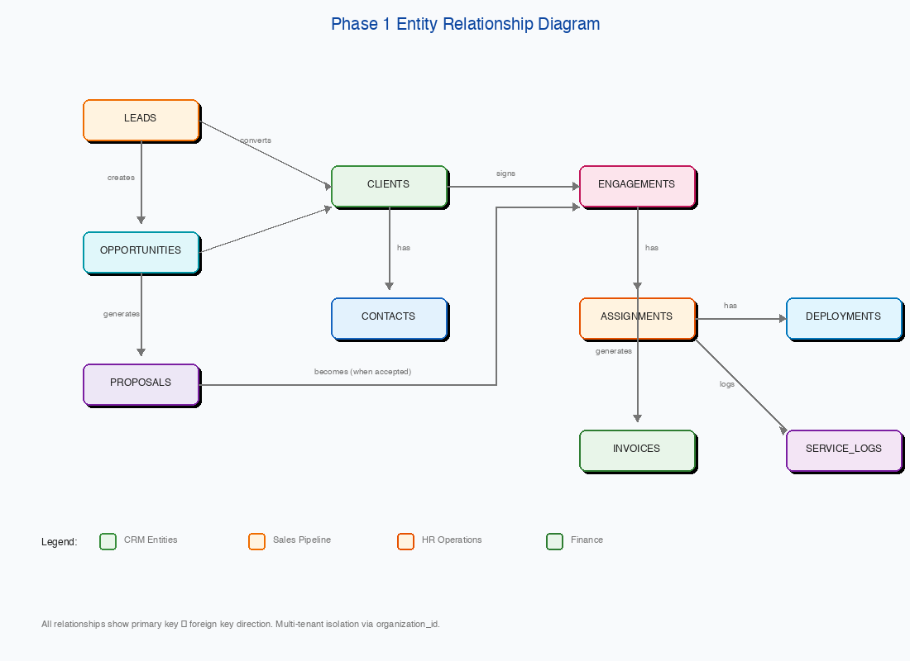

**Entity Groups:**

- **CRM Entities**: Clients, Contacts (core customer data)
- **Sales Pipeline**: Leads, Opportunities, Proposals (business development flow)
- **HR Operations**: Engagements, Assignments, Deployments, Service Logs
- **Finance**: Invoices, Payments (billing and receivables)
- **Cross-Cutting**: Notes, Comments, Approvals, Tasks, Documents, Activities, Audit Logs (polymorphic entities that attach to any primary entity)

### 8.2 Database Schema Design

#### 8.2.1 Multi-Tenant Strategy

```sql
-- Schema per tenant
CREATE SCHEMA tenant_{org_id};

-- All tables include organization_id
CREATE TABLE tenant_{org_id}.clients (
    id UUID PRIMARY KEY DEFAULT gen_random_uuid(),
    organization_id UUID NOT NULL REFERENCES public.organizations(id),
    ...
);

-- Row-level security policy
CREATE POLICY tenant_isolation ON clients
    USING (organization_id = current_setting('app.current_org')::uuid);
```

#### 8.2.2 Common Patterns

```sql
-- Soft delete pattern
deleted_at TIMESTAMP DEFAULT NULL

-- Audit columns
created_by UUID REFERENCES users(id),
created_at TIMESTAMP DEFAULT NOW(),
updated_at TIMESTAMP,

-- Check constraint example
CONSTRAINT positive_amount CHECK (amount >= 0)

-- Enum type example
CREATE TYPE client_status AS ENUM ('prospect', 'active', 'inactive', 'former');
```

### 8.3 Data Migration Requirements

| ID | Requirement | Priority |
|----|-------------|----------|
| DM001 | System shall support data import from Excel/CSV | High |
| DM002 | System shall validate imported data before commit | Critical |
| DM003 | System shall generate import error reports | High |
| DM004 | System shall support incremental data import | Medium |
| DM005 | System shall map imported fields to system fields | High |

### 8.4 Data Retention

| Data Type | Retention Period | Action |
|-----------|------------------|--------|
| Active records | Indefinite | N/A |
| Soft-deleted records | 1 year | Permanent delete |
| Audit logs | 7 years | Archive then delete |
| Notifications | 90 days | Auto-delete |
| Session logs | 30 days | Auto-delete |

---

## 9. Non-Functional Requirements

### 9.1 Performance Requirements

| ID | Requirement | Target |
|----|-------------|--------|
| PERF-001 | Page load time | < 3 seconds |
| PERF-002 | API response time (simple queries) | < 200ms |
| PERF-003 | API response time (complex queries) | < 1 second |
| PERF-004 | Report generation | < 10 seconds |
| PERF-005 | PDF generation | < 5 seconds |
| PERF-006 | File upload (25MB) | < 30 seconds |
| PERF-007 | Search results | < 500ms |
| PERF-008 | Concurrent users per tenant | 50+ |
| PERF-009 | Database queries per page | < 10 |
| PERF-010 | Frontend bundle size | < 500KB gzipped |

### 9.2 Scalability Requirements

| ID | Requirement | Target |
|----|-------------|--------|
| SCAL-001 | Total tenants supported | 100+ |
| SCAL-002 | Records per tenant | 100,000+ |
| SCAL-003 | Concurrent global users | 1,000+ |
| SCAL-004 | Daily API calls | 1,000,000+ |
| SCAL-005 | Document storage per tenant | 10GB+ |
| SCAL-006 | Horizontal scaling | Docker + load balancer ready |

### 9.3 Availability Requirements

| ID | Requirement | Target |
|----|-------------|--------|
| AVAIL-001 | System uptime | 99.5% |
| AVAIL-002 | Planned maintenance window | < 4 hours/month |
| AVAIL-003 | Unplanned downtime recovery | < 1 hour |
| AVAIL-004 | Data backup frequency | Daily |
| AVAIL-005 | Backup retention | 30 days |
| AVAIL-006 | Point-in-time recovery | 7 days |

### 9.4 Usability Requirements

| ID | Requirement | Priority |
|----|-------------|----------|
| USE-001 | Responsive design (mobile, tablet, desktop) | Critical |
| USE-002 | WCAG 2.1 AA accessibility compliance | High |
| USE-003 | Keyboard navigation support | High |
| USE-004 | Consistent UI patterns across modules | Critical |
| USE-005 | Contextual help and tooltips | Medium |
| USE-006 | Loading indicators for async operations | High |
| USE-007 | Form validation with clear error messages | Critical |
| USE-008 | Confirmation dialogs for destructive actions | Critical |
| USE-009 | Undo capability for recent actions | Low |
| USE-010 | Dark mode support | Low |

### 9.5 Reliability Requirements

| ID | Requirement | Priority |
|----|-------------|----------|
| REL-001 | Graceful error handling (no crashes) | Critical |
| REL-002 | Automatic session recovery | High |
| REL-003 | Data validation at all entry points | Critical |
| REL-004 | Transaction rollback on failure | Critical |
| REL-005 | Idempotent API operations | High |
| REL-006 | Retry logic for external services | High |

### 9.6 Maintainability Requirements

| ID | Requirement | Priority |
|----|-------------|----------|
| MAIN-001 | Code documentation (JSDoc) | High |
| MAIN-002 | API documentation (OpenAPI/Swagger) | Critical |
| MAIN-003 | Database migration scripts | Critical |
| MAIN-004 | Environment-based configuration | Critical |
| MAIN-005 | Structured logging | Critical |
| MAIN-006 | Health check endpoints | Critical |
| MAIN-007 | Automated testing (unit, integration) | High |
| MAIN-008 | CI/CD pipeline | Critical |

---

## 10. External Interface Requirements

### 10.1 User Interfaces

| Interface | Description |
|-----------|-------------|
| Web Application | Primary interface - React SPA |
| Mobile Web | Responsive design for mobile browsers |
| PDF Documents | Generated invoices, proposals, reports |
| Email Templates | Notification and communication emails |

### 10.2 Hardware Interfaces

| Interface | Description |
|-----------|-------------|
| File Upload | Support for standard file input devices |
| Printer | Browser-based printing for reports |

### 10.3 Software Interfaces

| System | Interface Type | Purpose |
|--------|----------------|---------|
| Rozitech Auth Server | REST API | Authentication and authorization |
| Rozitech Workforce | Database | Employee data (read-only) |
| Email Provider (SendGrid/Mailgun) | REST API | Email delivery |
| Cloud Storage (S3/GCS) | SDK | Document storage |
| PDF Generator (Puppeteer/WeasyPrint) | Library | PDF generation |

### 10.4 Communication Interfaces

| Protocol | Usage |
|----------|-------|
| HTTPS | All API and web traffic |
| WSS | Real-time notifications (future) |
| SMTP | Outbound email via provider |

### 10.5 Integration Stubs (Phase 1)

These integrations will be stubbed in Phase 1 for future implementation:

| Integration | Purpose | Phase |
|-------------|---------|-------|
| QuickBooks Online | Accounting sync | Phase 2+ |
| Xero | Accounting sync | Phase 2+ |
| Sage | Accounting sync | Phase 2+ |
| Outlook/Gmail | Email sync | Phase 2+ |
| SMS Gateway | SMS notifications | Phase 2+ |
| Calendar (Google/Outlook) | Meeting scheduling | Phase 2+ |
| Payment Gateway (Paystack/Flutterwave) | Online payments | Phase 2+ |

---

## 11. Security Requirements

### 11.1 Authentication

| ID | Requirement | Priority |
|----|-------------|----------|
| SEC-A001 | JWT-based authentication via Rozitech Auth Server | Critical |
| SEC-A002 | Token expiration (1 hour access, 7 days refresh) | Critical |
| SEC-A003 | Secure token storage (httpOnly cookies or secure storage) | Critical |
| SEC-A004 | Session invalidation on logout | Critical |
| SEC-A005 | Multi-tenant context in JWT claims | Critical |
| SEC-A006 | Password complexity requirements (8+ chars, mixed) | High |
| SEC-A007 | Account lockout after 5 failed attempts | High |
| SEC-A008 | Two-factor authentication support | Medium |

### 11.2 Authorization

| ID | Requirement | Priority |
|----|-------------|----------|
| SEC-Z001 | Role-based access control (RBAC) | Critical |
| SEC-Z002 | Permission-based granular access | High |
| SEC-Z003 | Tenant data isolation (organization_id) | Critical |
| SEC-Z004 | Resource-level authorization checks | Critical |
| SEC-Z005 | API endpoint authorization middleware | Critical |
| SEC-Z006 | UI element visibility based on permissions | High |

### 11.3 Data Protection

| ID | Requirement | Priority |
|----|-------------|----------|
| SEC-D001 | HTTPS encryption for all traffic | Critical |
| SEC-D002 | Database connection encryption (TLS) | Critical |
| SEC-D003 | Sensitive data encryption at rest | High |
| SEC-D004 | File upload virus scanning | Medium |
| SEC-D005 | PII data masking in logs | Critical |
| SEC-D006 | Secure file storage with access control | Critical |

### 11.4 Input Validation

| ID | Requirement | Priority |
|----|-------------|----------|
| SEC-V001 | Server-side input validation on all endpoints | Critical |
| SEC-V002 | SQL injection prevention (parameterized queries) | Critical |
| SEC-V003 | XSS prevention (input sanitization, CSP) | Critical |
| SEC-V004 | CSRF protection | Critical |
| SEC-V005 | File upload type validation | Critical |
| SEC-V006 | Rate limiting on API endpoints | High |
| SEC-V007 | Request size limits | High |

### 11.5 Audit and Compliance

| ID | Requirement | Priority |
|----|-------------|----------|
| SEC-C001 | Complete audit trail of data changes | Critical |
| SEC-C002 | User action logging | Critical |
| SEC-C003 | Login/logout event logging | Critical |
| SEC-C004 | Failed authentication attempt logging | Critical |
| SEC-C005 | Audit log tamper protection | Critical |
| SEC-C006 | Data export logging | High |
| SEC-C007 | NDPR compliance (Nigeria data protection) | Critical |

### 11.6 Security Roles

| Role | Permissions |
|------|-------------|
| System Admin | Full access, user management, system configuration |
| Organization Admin | Full tenant access, user management |
| Manager | Full access to assigned modules, team management |
| Staff | Create/edit assigned records, view team records |
| Read-Only | View access only, export capability |
| Auditor | Read-only access to all data and audit logs |

---

## 12. Appendices

### Appendix A: Glossary

| Term | Definition |
|------|------------|
| Account Manager | TeamACE employee responsible for client relationship |
| Assignment | Linking of a TeamACE employee to work at a client |
| Billing Schedule | Recurring billing arrangement with a client |
| Client | Company that TeamACE provides services to |
| Contact | Individual person at a client company |
| Deployment | Physical location where staff member works |
| Engagement | Project or contract with a client |
| Lead | Potential client not yet converted |
| Opportunity | Qualified sales prospect with value |
| Outsourced Staff | TeamACE employees working at client sites |
| Pipeline | Visual representation of sales opportunities |
| Proposal | Formal offer document to a prospect |
| Receivable | Money owed to TeamACE by clients |
| Service Log | Record of services rendered to a client |
| Tenant | Organization using the TeamACE platform |

### Appendix B: Sprint Deliverables

| Sprint | Module Focus | Key Deliverables |
|--------|--------------|------------------|
| 1-2 | Core CRM Base | Client + Contact CRUD, basic UI |
| 3-4 | Core CRM + BD | Engagement, Activity, Lead capture |
| 5-6 | BD Pipeline | Pipeline board, Proposals, Forecasting |
| 7-8 | HR Outsourcing | Assignment, Deployment, Service logs |
| 9-10 | Finance Light | Invoicing, Payments, Receivables |
| 11-12 | Workflow Layer | Approvals, Notifications, Tasks |

### Appendix C: Test Scenarios

#### C.1 Client Management Test Scenarios

| TC ID | Scenario | Expected Result |
|-------|----------|-----------------|
| TC-C001 | Create new client with valid data | Client created, number generated |
| TC-C002 | Create client with duplicate registration number | Error: duplicate |
| TC-C003 | Update client status from prospect to active | Status updated, activity logged |
| TC-C004 | Delete client with active engagements | Error: cannot delete |
| TC-C005 | Search clients by partial name | Matching clients returned |
| TC-C006 | Export clients to CSV | Valid CSV downloaded |

#### C.2 Invoice Management Test Scenarios

| TC ID | Scenario | Expected Result |
|-------|----------|-----------------|
| TC-I001 | Create invoice with line items | Total calculated correctly |
| TC-I002 | Apply 10% discount to invoice | Discount applied, total updated |
| TC-I003 | Add VAT to invoice | 7.5% VAT calculated |
| TC-I004 | Record partial payment | Balance updated, status partial |
| TC-I005 | Mark invoice as paid | Status changed, paid_at set |
| TC-I006 | Cancel sent invoice | Status cancelled, reason recorded |

### Appendix D: Wireframe Specifications

This section provides detailed wireframe specifications for all Phase 1 screens. All wireframes are provided as PNG images in the `wireframes/` directory.

#### D.1 Global Navigation & Layout

The global layout establishes the consistent structure used across all screens, featuring a collapsible sidebar navigation, top header with search and notifications, and a main content area.

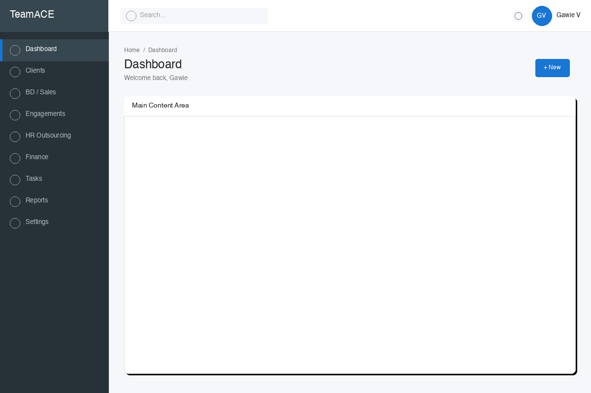

**Layout Components:**
- **Header Bar**: Logo, global search, notifications bell, user menu
- **Sidebar Navigation**: Collapsible, with expandable sub-menus for BD/Sales, HR Outsourcing, and Finance
- **Main Content Area**: Responsive container with breadcrumb navigation
- **Footer**: Copyright, help links, version info

#### D.2 Client Management Screens

**D.2.1 Client List Screen**

The client list provides a searchable, filterable view of all clients with key information at a glance.

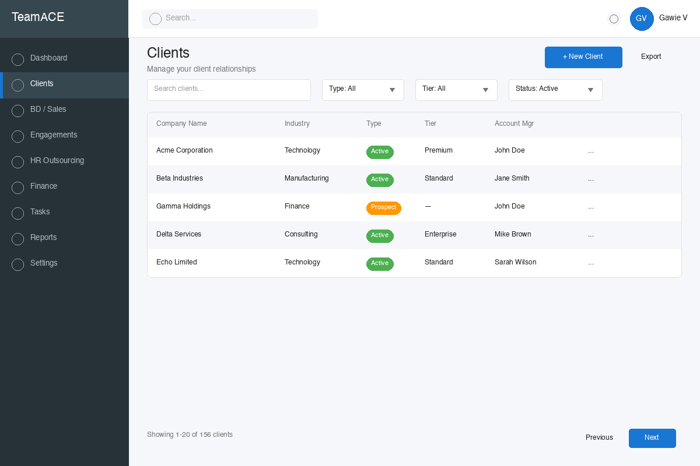

**Key Features:**
- Search by company name, contact, or any field
- Filter by client type, tier, and status
- Sortable columns
- Quick action menu (view, edit, delete)
- Pagination controls

**D.2.2 Client Detail Screen**

The client detail screen provides a comprehensive 360-degree view of a client with tabbed navigation to related data.

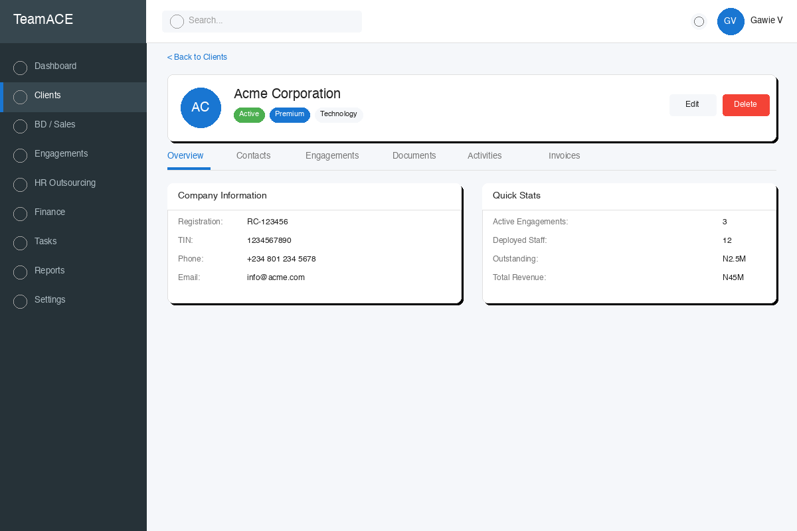

**Sections:**
- Company information with logo
- Quick stats (engagements, staff, revenue, outstanding)
- Primary contact details
- Tabbed navigation: Overview, Contacts, Engagements, Documents, Activities, Invoices

**D.2.3 Client Create/Edit Form**

The client form captures all essential information organized into logical sections with validation indicators.

#### D.3 Business Development Screens

**D.3.1 Pipeline Kanban Board**

The pipeline view provides a visual drag-and-drop interface for managing sales opportunities through different stages.

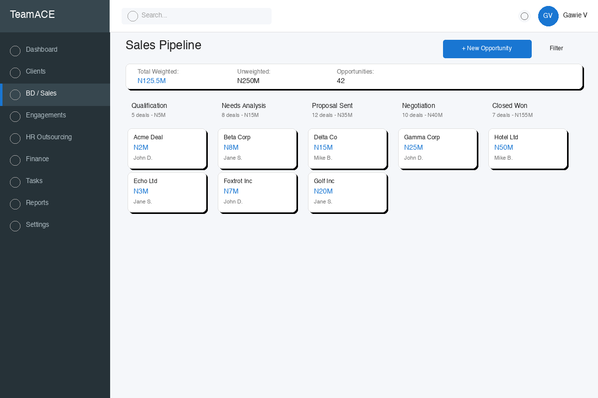

**Features:**
- Drag-and-drop opportunity cards between stages
- Stage summary showing count and weighted value
- Quick filters by owner, client, or date range
- Opportunity cards showing key metrics (value, owner, days in stage)
- Won/Lost columns for closed opportunities

**D.3.2 Lead Capture Form**

The lead form captures initial prospect information with required fields and source tracking.

**Form Sections:**
- Lead source with detailed attribution
- Company information
- Contact person details
- Service interests (multi-select checkboxes)
- Assignment and notes

**D.3.3 Proposal Builder**

Multi-step proposal creation with preview capability and document generation.

#### D.4 HR Outsourcing Screens

**D.4.1 Assignment List**

View and manage all staff assignments with filtering by client, status, and assignment type.

**List Features:**
- Employee-client relationship view
- Status indicators (Active, On Hold, Completed)
- Quick filters and search
- Pagination and sorting

**D.4.2 Assignment Detail**

Comprehensive view of a staff assignment with financial metrics, deployment history, and service logs.

#### D.5 Finance Screens

**D.5.1 Invoice List**

The invoice list provides comprehensive management of all invoices with status-based filtering and summary statistics.

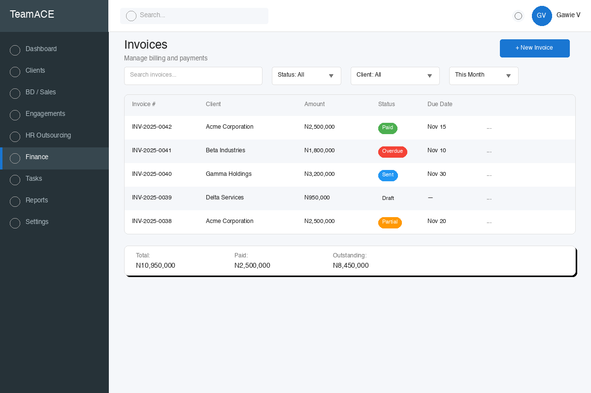

**Features:**
- Color-coded status badges (Draft, Sent, Paid, Overdue, Partial)
- Filter by status, client, and date range
- Summary totals at bottom (Total, Paid, Outstanding)
- Quick actions for each invoice

**D.5.2 Invoice Create/Edit**

Full invoice creation with line items, automatic tax calculations (VAT, WHT), and Nigerian currency formatting.

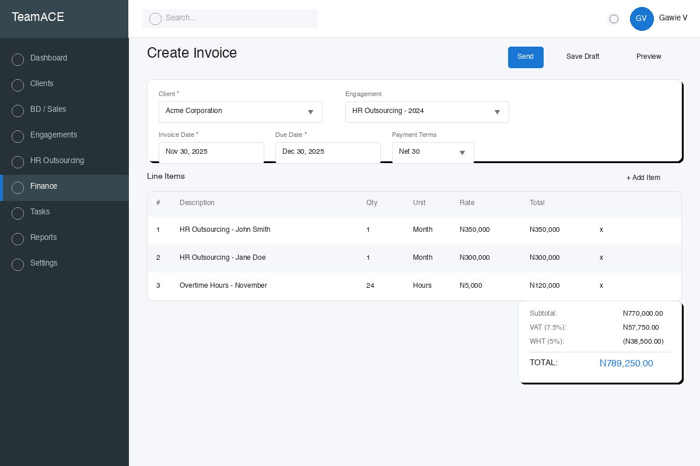

**Form Features:**
- Client and engagement selection
- Date fields with payment term auto-calculation
- Dynamic line items with add/remove
- Automatic tax calculations (VAT 7.5%, WHT 5%)
- Preview before sending

**D.5.3 Receivables Aging Report**

Standard aging report with 30/60/90+ day buckets and client-level breakdown.

#### D.6 Collaboration & Workflow Screens

**D.6.1 Task List (My Tasks)**

Personal task management with grouping by due date and related entity linking.

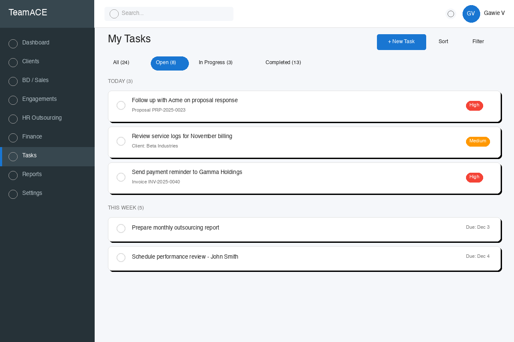

**Features:**
- Tab filters (All, Open, In Progress, Completed)
- Grouped by time period (Today, This Week, Later)
- Priority indicators with color coding
- Related entity links (client, invoice, proposal)
- Quick complete/snooze actions

**D.6.2 Approval Queue**

Centralized approval interface for invoices, leave requests, expenses, and other workflows requiring authorization.

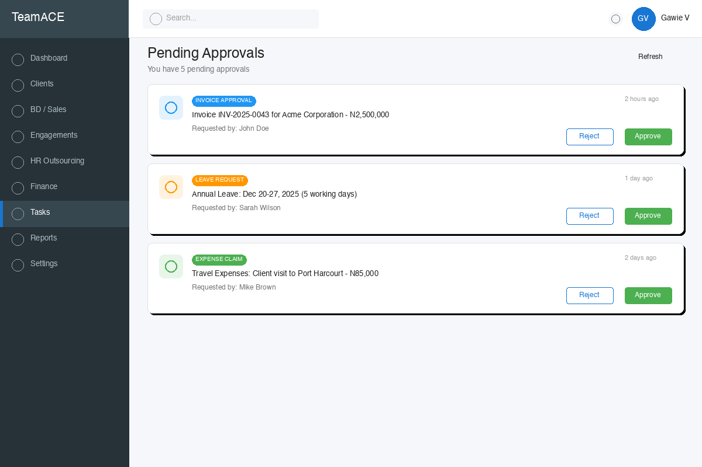

**Card Components:**
- Approval type with icon
- Summary of request with key details
- Requester and timestamp
- One-click Approve/Reject buttons
- View Details link for full information

**D.6.3 Notification Panel**

Slide-out notification panel accessible from the header bell icon.

#### D.7 Dashboard Screen

The dashboard provides an at-a-glance overview of key business metrics and pending items.

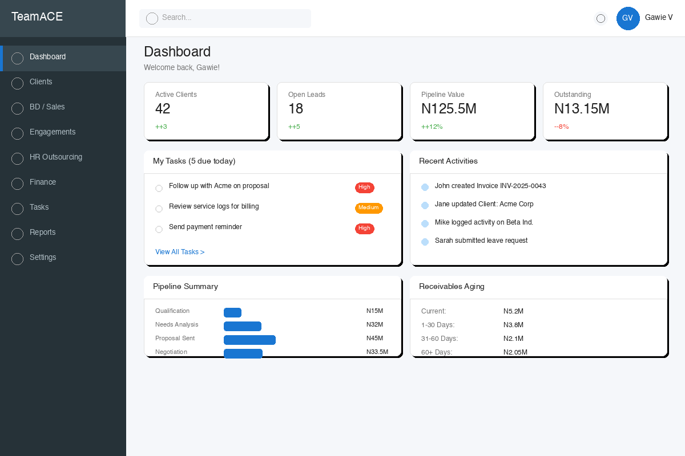

**Dashboard Widgets:**
- **Quick Stats Cards**: Active Clients, Open Leads, Pipeline Value, Outstanding Receivables
- **My Tasks**: Priority tasks due today with quick access to full task list
- **Recent Activities**: System-wide activity feed
- **Pipeline Summary**: Visual bar chart of pipeline stage distribution
- **Receivables Aging**: Summary of aging buckets
- **Upcoming Renewals**: Contracts expiring soon

#### D.8 Mobile Responsive Views

The system provides a fully responsive mobile experience optimized for field access.

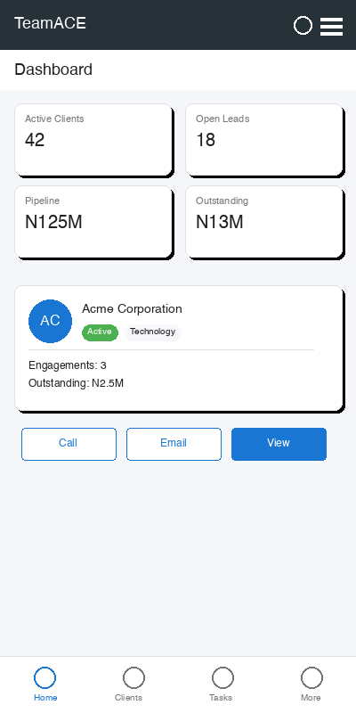

**Mobile Features:**
- **Hamburger Navigation**: Slide-out menu for all sections
- **Card-Based Layouts**: Touch-friendly information cards
- **Quick Actions**: Tap-to-call, tap-to-email buttons
- **Optimized Forms**: Mobile-friendly input fields
- **Offline Indicators**: Connection status awareness

### Appendix E: API Response Formats

#### E.1 Success Response

```json
{
  "success": true,
  "data": {},
  "meta": {
    "page": 1,
    "limit": 20,
    "total": 150,
    "totalPages": 8
  }
}
```

#### E.2 Error Response

```json
{
  "success": false,
  "error": {
    "code": "VALIDATION_ERROR",
    "message": "Validation failed",
    "details": [
      {
        "field": "email",
        "message": "Invalid email format"
      }
    ]
  }
}
```

#### E.3 Standard HTTP Status Codes

| Code | Usage |
|------|-------|
| 200 | Success |
| 201 | Created |
| 204 | No Content (delete) |
| 400 | Bad Request (validation error) |
| 401 | Unauthorized |
| 403 | Forbidden |
| 404 | Not Found |
| 409 | Conflict (duplicate) |
| 422 | Unprocessable Entity |
| 500 | Internal Server Error |

---

## Document Approval

| Role | Name | Date | Signature |
|------|------|------|-----------|
| Dev Lead | Gawie | | |
| Partner Representative | | | |
| Technical Reviewer | | | |

---

**Document Version History**

| Version | Date | Author | Changes |
|---------|------|--------|---------|
| 1.0 | 2025-11-30 | Rozitech | Initial draft |

---

*This document is confidential and intended for TeamACE and Rozitech use only.*
